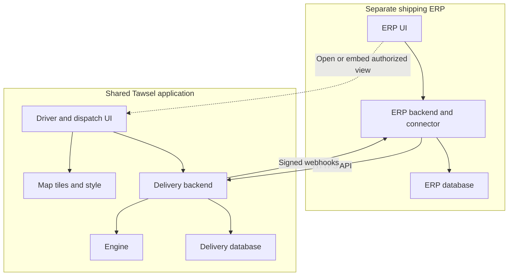

# Tawsel — Agreed Architecture and Repository Blueprint

Updated: 19 September 2026 — operational tracking and consistency requirements added.

Purpose: preserve the project's approved direction and show the complete outer architecture before separate product and implementation plans are written for each repository.

This is an architecture record, not an implemented system or a final API specification. **Agreed** means accepted by the user in this conversation. **Proposed** means a planning detail introduced here; exact names, schemas, and implementation choices will be finalized in the relevant repository plan.

## 1. الصورة المتفق عليها

- **Engine** = Nominatim + OSRM + VROOM وربط الخدمات الأساسية. المصطلح يفضل بالمعنى ده.
- ريبو `tawsel-routing` هيتوسع ليضم تطبيق توصيل مستقل حول الـEngine: Backend + واجهة مشتركة + قاعدة بيانات التطبيق + عقود التكامل.
- المندوب يستخدم تطبيق التوصيل مباشرة، كبداية PWA. واجهات التخطيط والمتابعة يمكن فتحها من الـERP ودمجها فيه عند الحاجة.
- كل ERP يبقى مشروعًا وريبو مستقلين؛ يرسل مهام التوصيل عبر API وتعود إليه حالات التنفيذ عبر Webhooks.
- واجهة الرحلات والخريطة تتطور في مكان واحد، ويصل تحديثها للشركات التي تستخدم التطبيق المركزي، مع مراعاة الجلسات المفتوحة والعمل Offline.
- الـERP يملك الطلب التجاري والحسابات؛ تطبيق التوصيل يملك الرحلة وتنفيذ الوقفات. لا وصول مباشر لقواعد بيانات بعضهما.
- **V1: متابعة تنفيذ المندوب مطلوبة**: الشحنات المنفذة ونتائجها، الوقفة الجاري تنفيذها، التالية المخطط لها، الرحلة الحالية وآخر تحديث مؤكد. تظهر في واجهة المتابعة المشتركة، وتصل بياناتها المسموح بها للـERP.
- حالة «متجه إلى شحنة» تحتاج إجراء واضحًا من المندوب؛ ترتيب الرحلة وحده لا يثبت أنه يتحرك إليها. البيانات غير المتزامنة تظهر كـPending أو Stale حسب الحالة، ولا تُعرض كتحديث لحظي مؤكد.
- **ACID داخل قاعدة بيانات كل تطبيق**. بين Tawsel والـERP نحتاج مزامنة موثوقة مع إعادة المحاولة ومنع التكرار واستعادة الفجوات؛ لا نَعِد بـTransaction واحدة عبر قاعدتي البيانات أو بتحديث فوري أثناء انقطاع الاتصال.
- **Live GPS Tracking مؤجل إلى V2 أو V3**. نجهز حدود التوسعة في التصميم والعقود، ولا ننفذ جمع المواقع أو التتبع في الخلفية في V1.
- التحسين المبني على بيانات استخدام الشركات مؤجل إلى **V3 أو بعده**؛ ليس وعدًا بموعد إصدار محدد.
- هذه الوثيقة تحدد حدود المشاريع والربط. التفاصيل النهائية للـframeworks والـschemas والـUX تأتي في خطط منفصلة.

## 2. Terms and approved decisions

| Term | Meaning |
| --- | --- |
| Engine | Nominatim geocoding, OSRM routing profiles, VROOM optimization, and their configuration/integration. |
| Tawsel delivery application | The common UI, backend, delivery data, and integration surface built around the Engine. This working label does not require a product/repository rename. |
| ERP | A separate business application, such as a shipping-company or restaurant system. |
| Tenant | A customer organization with its own authorized users and operational data. An ERP installation is not automatically identical to a tenant. |
| Integration | An authenticated connection from an external system to a Tawsel tenant. |
| Delivery task | Work requested by an ERP, linked to its source record using a stable external reference. |
| Trip | A planned and executed route assigned to a driver/vehicle. |
| Stop / visit attempt | An execution record within a trip. A failed attempt and a successfully completed delivery are different outcomes. |
| Operational tracking | Server-confirmed delivery progress: active trip, stop outcomes, explicit current stop, next planned stop, and update freshness. Required in V1. |
| Live location tracking | Repeated device location samples displayed with their age and accuracy. Deferred to V2 or V3; separate from delivery outcomes and from cross-company learning. |

Approved direction:

1. Keep the Engine reusable and independent of any particular ERP business model.
2. Expand `7ossam26/tawsel-routing` to house the delivery application around the Engine. Keep each ERP in a separate repository. No repository rename is needed now.
3. Maintain one shared delivery UI; do not copy/fork map and trip screens into every ERP.
4. Use a centrally hosted, tenant-aware delivery application as the default deployment model.
5. The driver's primary experience is the standalone application. Start with a PWA; React Native + Expo remains the later mobile direction.
6. ERP staff open authorized planning/trip views in the shared application. Embedding planning/monitoring is optional when a workflow requires it.
7. Keep an API for ERP integration and for Tawsel's own UI. Shared UI does not eliminate backend integration.
8. Support limited variations such as branding through configuration rather than customer-specific code forks.
9. Synchronize business and delivery data through explicit contracts with clear ownership.
10. Remain self-hosted/open-source first; paid per-request mapping APIs are not a core dependency.
11. Defer cross-company learning, pooled address intelligence, historical prediction, and traffic inference to V3 or later. Ordinary operational persistence and reliable synchronization are current requirements.
12. Establish the outer design before writing separate detailed plans and implementation code.
13. Make operational tracking available to dispatchers in V1 through the shared monitoring UI and authorized integration data. The actual shipping ERP implementation remains a later project.
14. Preserve local transactional integrity and provide recoverable synchronization between applications. Make delays and confirmation state visible instead of promising cross-database ACID.
15. Prepare an extension boundary for live driver GPS in V2 or V3. This does not bring background location or telemetry ingestion into V1.

Earlier constraints carried forward from the supplied project conversation: a small initial pilot; drivers preassigned to areas/tasks; up to 50 stops per route as the initial product target; no cross-driver global assignment required initially; external navigation for the next stop; no initial full in-app turn-by-turn navigation or background location. Offline downloaded-trip access and queued actions remain design requirements; re-optimization requires server access. These are earlier product decisions, not facts inferred from GitHub; exact workflows will be checked in the delivery plan.

## 3. Current repository evidence

Repository: [7ossam26/tawsel-routing](https://github.com/7ossam26/tawsel-routing).

Repository inspection recorded on 17 September 2026: reviewed `main` at commit [`82881e0eae0eb2ca37d5986bf407c6ddb694a078`](https://github.com/7ossam26/tawsel-routing/commit/82881e0eae0eb2ca37d5986bf407c6ddb694a078), including the recursive tree, Compose configuration, startup script, VROOM configuration, and stack report. No live inspection of the Windows machine was performed. The 19 September update changes this architecture record; it is not a new repository inspection or an implementation report.

| Existing path | Role |
| --- | --- |
| `docker-compose.yml` | Three OSRM servers, three preprocessing jobs, and Nominatim. |
| `profiles/motorcycle.lua` | Custom motorcycle routing profile. |
| `vroom-conf/config.yml` | VROOM configuration targeting the OSRM services. |
| `setup.ps1` | Local setup/startup and explicit opt-in Nominatim import. |
| `test-vrp.json` | Example optimizer request. |
| `data/` | Tracked placeholder; actual datasets/generated artifacts stay outside Git. |
| `README.md`, `STACK-CONTEXT.md` | Operating instructions and a local environment report. |

At the reviewed commit, the repository had no application UI/backend, application database schema, tenant authorization, or ERP integration contract. VROOM was configured but created outside Compose. The report records prior successful local pipeline testing; that is not fresh production validation.

Production planning must bring VROOM into managed deployment, keep raw Engine/database ports private, separate data import from normal startup/releases, and pin/test image-data compatibility. Preserve existing volumes and script paths during any reorganization. Local development configuration must not be treated as the production deployment.

## 4. Overall topology

Repositories store code. Their deployed applications communicate over HTTPS; GitHub is not involved in runtime requests.



Inside the Engine, VROOM calls OSRM. The delivery backend handles geocoding and orchestration. Another ERP, such as a restaurant system, uses its own connector/credentials to the same delivery backend and UI.

## 5. Repository A: additions to `tawsel-routing`

One repository can contain separately buildable/deployable components. A modular backend is sufficient initially; this design does not require a large microservices system.

Proposed paths are a responsibility map. They have not been added to GitHub, and existing files do not need to move immediately.

| Proposed area | Responsibility |
| --- | --- |
| Existing Engine files | Preserve Compose, profiles, VROOM configuration, and setup knowledge. Move under `infra/engine/` only through an intentional migration that updates all paths. |
| `apps/web/` | Shared PWA: login, organization context, map, trips, ordered stops, next-stop detail, driver actions, and dispatcher progress monitoring with confirmation/freshness indicators. |
| `apps/api/` | Modular delivery backend: tenants/auth, tasks, execution driver/vehicle records, trips, planning, transactional state transitions, monitoring snapshots, integration API, and durable webhook delivery. |
| `apps/api/engine/` | Internal adapters for Nominatim, OSRM, and VROOM. Provider formats and solver integer IDs remain behind the application API. Actual module paths depend on the framework. |
| `apps/api/database/` | Delivery database schema/migrations. PostgreSQL is the carried-forward direction; this is separate from Nominatim's private database. |
| `contracts/openapi.yaml` | Canonical HTTP contract: operations, schemas, auth, errors, examples, and compatibility rules. |
| `contracts/events/` | Versioned webhook envelopes and event payload schemas. |
| `contracts/examples/` | Example messages and a small mock client/integration fixture. |
| `infra/maps/` | Chosen tile/style hosting configuration and data preparation instructions. Exact technology is open. |
| `docs/` | Architecture decisions, integration guide, onboarding, operations, and `tracking-and-consistency.md` covering V1 progress, transaction boundaries, recovery, and the future GPS seam. |
| Deployment/CI configuration | Independent UI/API releases, safe migrations, and meaningful checks of the main flow, authorization, contracts, state transitions and duplicate handling. |
| Future `apps/mobile/` | React Native + Expo when the native phase starts; not needed for the PWA pilot. |

The application backend owns persisted delivery state. A worker for optimization and webhook retries can use the same backend codebase. A simple durable database-backed design is a reasonable starting proposal; this blueprint does not select Kafka, Redis, Kubernetes, or a separate queue product.

Expected application concepts: organizations, memberships/roles, integrations, execution driver/vehicle records, delivery tasks, trips, stop attempts, optimization runs, action history, client-action deduplication, resource revisions, and a transactional event outbox. Current/next-stop indicators and counters must either be derived consistently or updated with the state that determines them. These are responsibilities, not a finalized schema. Future location telemetry is a separate logical module; it does not require a separate service or database now.

### Map display is an additional component

The current Engine produces coordinates, routes and geometry, not the visible basemap. The UI needs a renderer and tile/style source. MapLibre GL JS is the proposed web renderer, consistent with the project's MapLibre direction. Plan the tile source, style, Arabic labels, fonts/sprites where needed, attribution and update procedure. Prefer self-hosting and do not assume example/public tile endpoints are the production service.

MapLibre documents the [renderer](https://maplibre.org/maplibre-gl-js/docs/) and its separate [sources](https://maplibre.org/maplibre-style-spec/sources/). Keep source/style URLs configurable so changing map hosting does not require editing each ERP.

Missing or ambiguous addresses need confirmation or a pin. An unsuccessful geocode must not silently dispatch a driver to the wrong place. Incomplete optimization results must expose unassigned work before publication.

## 6. Repository B: shipping ERP

Working name: `shipping-erp` — illustrative, not an existing repository created by this plan.

The ERP will have its own product requirements: shipments/orders, merchants/customers, branches, commercial rules, billing/collections and other business modules as needed. This blueprint does not decide its complete entity model.

| ERP component | Responsibility |
| --- | --- |
| Business UI/backend/database | Own source orders, decide delivery eligibility, and enforce business rules. |
| `integrations/tawsel/` | Server-side connector mapping ERP records into generic delivery tasks and using the published HTTP contract. The actual path depends on framework. |
| Private integration configuration | API base URL, tenant-bound service credentials, webhook verification secret, supported contract version, and UI entry configuration. |
| Reference mapping | Link source task/shipment references with Tawsel task/trip/driver/vehicle IDs where needed; preserve tenant/integration scope. |
| Outgoing intent and retries | Persist submission/update/cancellation intent and retry transient failures without duplicate work. |
| Webhook receiver and inbox | Verify and durably accept events, deduplicate in the integration scope, and apply the projection plus processed marker in one ERP database transaction. Receiving and applying are distinct states. |
| Reconciliation | Fetch current task/trip state after missing or out-of-order updates; support controlled recovery. |
| UI entry points | Open planning/View trip/Monitor drivers, optionally embed the shared monitoring UI, and show lightweight synchronized shipment/driver progress summaries where useful. Do not rebuild the trip/map UI. |
| Integration visibility | Pending sync, failed sync, last updated, and authorized retry/recovery. |

The ERP consumes the contract, not Tawsel's server source code or database. It does not reimplement the raw Engine APIs or the map/trip UI. A generated API client may help later, but is not required; no third shared repository is needed now.

## 7. Data ownership

| Information/action | Authoritative owner | Other side's role |
| --- | --- | --- |
| Source order/shipment and delivery eligibility | ERP | Tawsel receives tasks and necessary operational data. |
| Prices, invoices, accounting, settlement | ERP | Delivery outcomes feed ERP rules; delivery success is not proof of payment. |
| Customer master | ERP | Tawsel stores only the operational delivery snapshot/contact details its workflow needs. Retention is a later design decision. |
| Delivery task, trip, route revision, stop outcome | Tawsel | ERP keeps IDs and a projection of delivery state. |
| Driver execution progress, explicit current stop and next planned stop | Tawsel | ERP displays an authorized projection or opens the shared monitoring UI; it does not independently decide the next stop. |
| Future latest location and telemetry | Tawsel delivery application's future location module | ERP consumes authorized location views/data through an extension of the published boundary; location is not a delivery outcome. |
| Driver HR data | ERP where applicable | Tawsel stores execution identity/vehicle/availability information needed for delivery. |
| Tawsel membership and trip permissions | Tawsel | A future trusted sign-in handoff can map users; each request still needs authorization. |
| Source change/cancellation | ERP requests; Tawsel validates execution transition | ERP handles acceptance or conflict, rather than assuming a live task disappeared. |
| Assignment and execution | Tawsel's authorized delivery workflow | ERP can submit intended assignments/request changes through the contract. Initial planning respects preassigned areas/tasks. |

Each application commands the authoritative owner instead of independently overwriting the other's state. Exact update/cancellation/reassignment rules will be designed before implementation.

## 8. Integration contract

The contract defines operations, fields, units, auth, results, failures, retry behavior and compatibility. [OpenAPI](https://spec.openapis.org/oas/latest.html) describes the HTTP interface independently of programming language. Events and UI entry also need written contracts.

Canonical definitions live in `tawsel-routing`. The ERP consumes a released compatible version. Endpoint paths, field names and state names below are proposed examples, not implemented interfaces.

### 8.1 Four interfaces

| Interface | Direction | Purpose |
| --- | --- | --- |
| Integration HTTP API | ERP backend to Tawsel backend | Submit/update tasks, create trips, request planning, publish approved plans, and read authorized progress snapshots/history for monitoring and recovery. |
| Webhook events | Tawsel backend to ERP backend | Report relevant changes to the originating integration. |
| UI entry/session | ERP UI to hosted Tawsel UI | Open an authorized view; optionally enable sign-in handoff/embedding. A URL alone is not authorization. |
| Driver/dispatcher API | Tawsel UI to Tawsel backend | Execute authorized actions. Browser users must not receive ERP service credentials. |

### 8.2 Rules to formalize

- HTTPS + JSON, under a versioned prefix such as `/v1`.
- Separate service credentials per tenant/integration, with limited permissions. Derive scope from verified credentials; do not trust an arbitrary submitted `tenant_id`.
- Opaque string application IDs. Map to VROOM integer IDs internally within the correct optimization run.
- Stable `external_task_ref`, unique within `(tenant, integration)`. A source shipment may later generate more than one task; do not globally equate a source order with one trip forever.
- Explicit longitude/latitude fields in the public contract; adapt to internal `[lon, lat]` arrays. Distances in meters; durations in seconds.
- Explicit timestamp offsets/UTC for event instants and an IANA zone such as `Africa/Cairo` for scheduling. Translate all solver times onto one documented shared time basis, rather than a separate zero per vehicle.
- Proposed public vehicle types: `car`, `bicycle`, `motorcycle`. Map public `bicycle` to the existing VROOM `bike` key inside the adapter.
- Idempotency for mutations: repeating the same request/key returns the same logical operation; conflicting reuse is rejected. Scope keys by caller and operation.
- Revision checks for concurrent edits and route changes. Define permitted changes before/after publication and during execution.
- Monitoring snapshots must include their authoritative resource version, relevant route revision, server update time, current/next-stop semantics, and synchronization metadata. Keep event-schema versions distinct from resource revisions and any stream cursor.
- Define the online freshness target and recovery path for both Tawsel UI and ERP projections. Select polling, SSE or WebSocket transport to meet the target; the transport alone is not persistence or a consistency guarantee.
- Distinguish task acceptance, completed optimization, and publication. `202 Accepted` means processing was accepted, not that a feasible route is ready.
- Explicit unresolved/unassigned work and errors for validation, permissions, state conflicts, dependency outages and limits. No silent dropping of tasks or false success.
- Compatible consumers continue working during ordinary releases. Breaking changes need a new supported contract version and migration.

### 8.3 Proposed operation families

| Operation | Purpose |
| --- | --- |
| `POST /v1/tasks` | Create a delivery task; return an application ID and readiness/state. Design batch import when needed. |
| `GET /v1/tasks/{taskId}` | Read current authorized state for display/reconciliation. |
| `PATCH /v1/tasks/{taskId}` | Update allowed inputs with a revision check. |
| `POST /v1/tasks/{taskId}/cancel` | Request cancellation subject to execution state. |
| `POST /v1/trips` | Create a draft from eligible tasks and authorized driver/vehicle/start settings. |
| `POST /v1/trips/{tripId}/optimizations` | Request persisted optimization; receive an operation ID. |
| `GET /v1/operations/{operationId}` | Read queued/running/succeeded/failed state and result reference. |
| `GET /v1/trips/{tripId}` | Read ordered stops, geometry, estimates, outcomes and route revision. |
| `POST /v1/trips/{tripId}/publish` | Publish an approved, valid route revision to the driver. |
| `POST /v1/trips/{tripId}/start` | Assigned, authorized driver starts a trip. |
| `POST /v1/trip-stops/{stopId}/actions` | Driver records an allowed outcome with a stable client action ID. |
| Driver/trip monitoring snapshot and history operations | Read the active assignment, outcomes, explicit current stop, next planned stop, revision and update time. Final paths, pagination and integration visibility are discovery decisions. |
| Conditional polling or resumable changes interface | Keep authorized monitoring views current and recover after disconnects; the selected transport must have a documented gap-free recovery strategy. |
| Location search/reverse and roster operations | Used by Tawsel UI; exact exposure to ERP integrations is a later contract decision. |

Not every caller gets every operation. ERP service credentials must not automatically impersonate drivers completing stops.

### 8.4 Example messages

Illustrative task creation: tenant/integration come from verified server credentials. The coordinates represent an already confirmed location, not a newly performed geocode.

```json
{
  "external_task_ref": "delivery:SHP-1042",
  "kind": "delivery",
  "destination": {
    "address_text": "Tahrir Square, Cairo",
    "coordinates": { "longitude": 31.2357, "latitude": 30.0444 },
    "location_source": "user_confirmed"
  },
  "service_seconds": 300
}
```

Illustrative result:

```json
{
  "task_id": "tsk_1042",
  "external_task_ref": "delivery:SHP-1042",
  "status": "ready_for_planning",
  "resource_version": 1
}
```

The full contract will specify required contact fields, constraints, validation, missing-location behavior and complete state machines. `ready_for_planning` is a proposed label.

Proposed events include `trip.published`, `trip.started`, `delivery_task.completed`, `delivery_attempt.failed`, `task.cancelled`, `trip.completed`, and an execution-progress event such as `trip.execution.updated`. The final contract must carry enough authorized progress data, or a versioned read reference, for monitoring to recover the current/next stop after an action or route change. A task-completed event alone is not a complete trip snapshot. A completed trip may contain unsuccessful stops; it does not mean all shipments were delivered.

```json
{
  "event_id": "evt_9001",
  "event_version": "1",
  "type": "delivery_task.completed",
  "occurred_at": "2026-09-17T12:35:00Z",
  "tenant_id": "org_a",
  "integration_id": "int_shipping_a",
  "data": {
    "task_id": "tsk_1042",
    "task_version": 4,
    "trip_id": "trp_88",
    "stop_id": "stp_307",
    "external_task_ref": "delivery:SHP-1042"
  }
}
```

Document a signature/timestamp protocol and a configured webhook destination bound to the originating integration. Do not broadcast one company's events to other integrations. Even within one tenant, an integration must not receive other sources' shipment/contact data merely because a trip is shared. Delivery is **at least once**, with the transactional outbox/inbox and recovery rules in section 10. Resource versions must identify their aggregate and allow receivers to detect stale state and gaps. Specify whether each event carries a replacement snapshot or an ordered change: skipping an older snapshot can be safe, but silently dropping a required business transition is not. Signature verification, quick acknowledgments and redelivery handling are established [webhook practices](https://docs.github.com/en/webhooks/using-webhooks/best-practices-for-using-webhooks); our exact delivery guarantees must be implemented by Tawsel and its connector.

## 9. Shared UI and login

Drivers use the standalone authenticated application. ERP staff can initially open an authorized deep link to planning or a trip. Tawsel verifies session, organization membership and resource access; a user without a session may need to sign in.

Seamless sign-in handoff is a separate design using suitable federated identity or a short-lived single-use exchange. Never place long-lived service credentials in URLs, iframe attributes or browser code. The identity provider/protocol remains open.

Embedding is optional for web planning/monitoring. It needs explicit embedding policy, authentication and a small documented message interface where required. Driver execution should not depend on an ERP iframe. See [iframe behavior](https://developer.mozilla.org/en-US/docs/Web/HTML/Reference/Elements/iframe).

Central UI releases do not require rebuilding every ERP. PWA clients receive them when a new version is fetched/activated; existing sessions/offline devices can lag. Keep compatible APIs/local data during the transition and avoid forced reloads in active work. Native mobile later uses the same backend/contracts, with its own build/update lifecycle; every web UI component need not transfer literally to React Native.

Independent customer installations or separate branded app-store binaries would need their own release management. One source repository alone does not update such installations automatically.

## 10. Operational tracking, consistency, and future location

### 10.1 V1 dispatcher experience

For each authorized driver/assignment, the shared monitoring view must show the active trip, ordered stops, successful deliveries, failed/skipped/cancelled attempts as separate outcomes, remaining work, explicitly active stop, next planned stop, and the relevant revision and timestamps. Counts and stop details must agree for the same snapshot. Define what happens with no active trip, completed trips, reassignment and multiple trips during discovery.

The initial trip map shows planned destinations and route geometry. It does not imply a live driver-position marker. Distinguish:

- **Next planned stop:** the next eligible stop according to the accepted route and execution rules.
- **Driver reported heading to / arrived:** an explicit permitted action, if these states are adopted in discovery.
- **Last confirmed delivery outcome:** a committed server record.
- **Pending local action:** captured on the device, not yet accepted by Tawsel.

Route order alone does not establish movement or arrival. Completing a stop must not automatically claim the driver started travelling to the next one. Reordering, skipping, failed attempts and cancellation must have defined effects on current/next-stop semantics.

Show last server update and relevant synchronization status. Distinguish last activity, last successful device contact when available, and data freshness: an idle driver is not necessarily offline. Do not invent a connection status when the system cannot observe it. Pending offline actions are visible on the device; dispatchers only see what has reached the server. Agree on a measurable online freshness target, expected pilot load and stale thresholds during discovery, rather than promising zero delay.

ERP users can open or embed this common monitoring screen. The ERP may also show small delivery summaries from its local projection, with a separate last-applied/sync indicator. The shared Tawsel view reads Tawsel's authoritative state; an ERP summary may temporarily lag. Both views must identify the same resources and revisions. The later ERP plan must consume these requirements and the as-built handoff.

### 10.2 Local ACID and reliable cross-system synchronization

**Requirement:** protect delivery invariants locally and make every committed change recoverably available to consumers. Do not describe the independent Tawsel and ERP databases as one ACID transaction. Cross-system projections are eventually consistent; online updates should meet the agreed freshness target, and outages must produce visible delay and recoverable backlog.

**Recommended initial implementation:** a relational application database, short transactions, a transactional outbox, and a durable worker within the modular backend. This does not require a new message-broker product or distributed two-phase commit.

1. In one Tawsel database transaction, authorize and validate the driver action against current assignment/state/revision; record the idempotency result; update the affected task/attempt/trip and any stored progress indicators; append the audit/action record; and insert the required outbox events. Commit all of these or none. Derived progress must be read from a coherent committed snapshot.
2. Use appropriate constraints, locking or conditional version updates for the actual invariants. ACID is not supplied by a diagram: two concurrent actions must not double-complete a task or produce contradictory assignments/current stops. Document the chosen isolation strategy and conflict responses.
3. Publish integration events and UI change notifications only from committed state. The worker retries durable outbox work after crashes. A crash after commit but before sending must not lose the event; a crash after sending but before recording success may cause redelivery, so receivers must be idempotent. Retain failed work for controlled replay and expose retry exhaustion.
4. The ERP receiver verifies the message and durably records it in an inbox before acknowledging acceptance. In a separate local transaction when processing asynchronously, apply the business projection and mark the inbox item processed together. A crash must not leave a processed marker without its state change. Durable receipt is not proof that the ERP screen already applied the update. An inline receiver may instead commit receipt, application and processed status together before acknowledging.
5. Use caller-scoped command/action IDs and integration-scoped event IDs to deduplicate retries. Server-assigned resource revisions establish authoritative ordering; device timestamps do not. Define expected ordering per aggregate, route-revision changes, gap detection, retention and replay/reconciliation behavior. Do not promise exactly-once network delivery.
6. Record outgoing ERP submission/change intent in the same local ERP transaction as the relevant source change when both must occur together. Retry HTTP calls outside that transaction; Tawsel applies its own idempotency/state checks. Cancellation or re-assignment remains a request until the authoritative owner accepts it.
7. Do not hold database transactions open while calling the Engine, ERP, webhooks or other network services. Long work is a persisted operation with a result committed after validating that its source revision is still applicable.

The [PostgreSQL transaction tutorial](https://www.postgresql.org/docs/current/tutorial-transactions.html) describes local transactional behavior. The [transactional outbox pattern](https://docs.aws.amazon.com/prescriptive-guidance/latest/cloud-design-patterns/transactional-outbox.html) explains why business state and outbound event intent should be committed together. These sources support the design; they do not select a hosting provider or prove our future implementation.

### 10.3 Monitoring reads, reconnects and time semantics

- Supply authorized driver/trip snapshots and required execution history through the documented API. State which fields are authoritative and which are projections, plus resource/route versions, server update time and applicable synchronization metadata.
- Choose the simplest transport that satisfies the freshness target: bounded polling can be sufficient for the pilot; SSE/WebSocket is an option when justified. These mechanisms deliver notifications; the database remains the authority.
- If incremental streams are selected, specify snapshot/subscription ordering, durable cursor or equivalent replay, reconnect catch-up and expired-cursor recovery. A change between initial snapshot and subscription must not disappear. A polling design must refresh snapshots reliably after interruption and avoid regression to older responses.
- Distinguish device action capture time, server receipt/commit time and ERP projection application time where needed. Define clock-skew handling and use server revisions for ordering. A device's clock cannot make a stale action authoritative.
- Specify how offline actions are queued, submitted in order where required, accepted, rejected or reconciled after route/assignment changes. Never silently overwrite a newer published plan or mark a local queued action globally confirmed.
- Make event-delivery lag, oldest pending work, processing failure, replay/reconciliation outcome and UI freshness observable. Agree on retention and idempotency windows compatible with the expected offline/retry period.

### 10.4 Future live GPS: V2 or V3

Prepare the design boundary now; do not implement the location pipeline, background permissions, location history storage or live marker in V1. Preserve stable tenant, driver, device/session and assignment/trip identities so a later location module can attach samples to the right authorized context. Decide during the later phase whether a separate device identity is needed; document the extension seam now without creating empty infrastructure.

The future location contract should consider WGS84 longitude/latitude, accuracy in meters, sample time, server receipt time, sample ID and session sequence, with speed/heading only if useful. Location samples have their own ordering and lifecycle; they must not increment a business trip revision or lock delivery state for every GPS update. Old or duplicate samples must not overwrite the latest eligible position. Treat this as a future design sketch, not an active V1 endpoint or finalized schema.

The shared map can later add an authorized location layer reused by ERP viewers. Display the last received position with age, accuracy and relevant permission/signal state, rather than promising the exact present position continuously. Location samples alone must not complete deliveries or assert arrival; any later geofencing rule needs explicit product design.

Decide sampling/batching, authentication, assignment validation, visibility, retention, deletion, device permissions and operating-system background behavior in that future phase. The web [Geolocation API](https://developer.mozilla.org/en-US/docs/Web/API/Geolocation_API) requires a secure context and user permission; the PWA pilot is not a promise of reliable background tracking. Validate platform capabilities when choosing the native/mobile implementation.

This telemetry module belongs to the delivery application. Nominatim, OSRM and VROOM remain reusable Engine services. Future live location and cross-company learning are different workstreams; learning remains deferred to V3 or later.

### 10.5 Planning deliverables and evidence

The detailed plan must create `docs/tracking-and-consistency.md` and carry these requirements into the data model, state machines, OpenAPI, event schemas/examples, shared monitoring UX, integration guide and final `docs/ERP-INTEGRATION-HANDOFF.md`. That document records transaction boundaries/invariants, current/next-stop rules, freshness targets, offline conflicts, message processing, ordering/recovery and the deferred GPS extension.

The phase plan must explicitly cover contract/document creation, transactional execution/outbox, monitoring, the mock ERP inbox/projection, and recovery verification. Deliver actual maintained documents and working artifacts; do not count empty files or a proposed endpoint as completed implementation.

Meaningful verification includes: rollback without partial progress or an emitted event; concurrent/duplicate actions; a worker crash after commit and before send; receiver crash/retry without losing a projection; duplicate and reordered events; recovery from missing updates; offline action conflicts; current/next-stop changes after failure/skip/reordering; reconnect without missed or regressed state; and tenant/integration isolation. Use the mock ERP to demonstrate this now. Building the real shipping ERP and collecting GPS samples are not prerequisites.

## 11. End-to-end workflow

1. Provision the tenant, users/driver records, ERP integration credentials, webhook destination and reference mappings.
2. ERP marks a shipment eligible and durably records intent to submit it.
3. Connector sends a task with a stable external reference. Tawsel returns a task ID; ERP stores the mapping.
4. Dispatcher opens the common planning UI, confirms locations, selects the preassigned driver/tasks/vehicle and creates a draft trip.
5. Tawsel persists planning work, calls the Engine and shows the result or unresolved/unassigned tasks. Dispatcher approves and publishes a valid route revision.
6. Driver accesses the assigned trip through the standalone PWA, views the map/next stop and records actions.
7. Tawsel validates each action and commits its delivery/progress state, audit/idempotency record and outbox event in one local transaction. Offline actions remain pending until server acceptance; stale/conflicting actions need defined handling.
8. Shared monitoring refreshes the committed trip snapshot, including the explicitly current stop and next planned stop. Dispatchers see confirmation/freshness and failure states.
9. The worker delivers events; the ERP verifies/deduplicates them and atomically applies each valid projection with its processed marker. The ERP updates its summaries from committed local state. Accounting follows ERP rules.
10. Retries, replay and current-state reads repair synchronization gaps without duplicate tasks or older projections overwriting newer state. Location collection is not part of this V1 flow.

A future restaurant supplies different source mappings and business rules. The shared delivery UI/backend are reused, while new readiness/time constraints may require deliberate contract extensions. Reuse does not imply zero integration work for every industry.

## 12. Operational failure behavior

| Situation | Required behavior |
| --- | --- |
| ERP retries after a timeout | Idempotency/reference rules prevent duplicate tasks or commands. |
| Engine unavailable or unassigned work remains | Retain draft and expose failure/incompleteness; do not silently dispatch an invalid plan. Stored trips should not need re-optimization merely to open. |
| ERP webhook destination offline | Persist/retry events; show synchronization status to authorized operators. |
| Duplicate/out-of-order event | Deduplicate, compare versions and reconcile authoritative state. |
| Driver offline | Preserve downloaded trip and queue allowed actions; distinguish local pending state from server-confirmed state. Offline basemap coverage is a separate scope decision. |
| Order changes after dispatch | Validate update/cancellation rules and revisions; surface conflicts rather than silently changing live work. |
| Cross-tenant resource request | Backend rejects access independently of UI filters or URL structure. |
| Action transaction rolls back | No partial task/trip/progress update or outbound event; the client receives an accurate failure/retry result. |
| Worker crashes after commit | Recover pending outbox work; tolerate redelivery if sending happened before its success was recorded. |
| ERP processing crashes | A durably accepted inbox item remains recoverable; its projection and processed marker commit together. |
| Monitoring connection drops | Show stale/unknown freshness appropriately and recover a consistent snapshot or resume safely. Do not infer driver motion or invent an online/offline state. |
| Route order or active assignment changes | Revalidate queued actions and update current/next-stop semantics against the accepted revision. |

These are ordinary application correctness requirements, not the deferred learning project.

## 13. Deployment boundary

- Deploy the shared UI/API, application database, Engine and selected map source under managed configuration. Public traffic reaches HTTPS application/tile endpoints; raw Engine/database ports stay private.
- ERP has a separate deployed application/database. Both applications may initially share a VPS. Measure actual disk, memory and concurrency before making capacity promises.
- UI/API releases must be independent of expensive Engine data import/rebuild. A UI change must not trigger OSRM preprocessing or Nominatim import.
- Include persistence, backups, secret configuration, health/readiness, durable worker recovery, event lag and rollback in the deployment plan. Back up required delivery/audit/outbox state consistently and document reconciliation after restoration. A shared deployment centralizes maintenance and also concentrates failure impact.
- Release contract versions with the application. Compatible improvements roll out centrally; breaking changes require explicit consumer migration.

## 14. Deferred scope and next planning boundaries

Deferred to V3 or later: cross-company learning, pooled address knowledge, historical ETA models, road-speed learning and live traffic inference. Routine fixes, upgrades, map maintenance and performance tuning can still happen normally.

Deferred separately to V2 or V3: live driver GPS, background location collection and the location telemetry pipeline. V1 includes delivery-progress tracking, local transactional correctness, dependable synchronization and shared dispatcher monitoring. Future compatibility means documented ownership, identities and extension points, not claiming the later feature already works.

A map/trip experience inspired by Uber/InDrive does not imply a full ride-hailing system. A universal ERP builder, per-customer UI forks, a third contract repository and a large service mesh are unnecessary now.

| Separate plan | Decisions to make |
| --- | --- |
| Delivery product/backend | Roles, state machines, assignment authority, current/next-stop rules, failed-attempt/retry/cancellation, transaction invariants, snapshots/events, concurrency, offline conflicts and retention. |
| Delivery frontend | Driver/dispatch journeys, operational monitoring and freshness, Arabic/RTL, map interaction, location confirmation, navigation handoff, PWA updates and offline scope. |
| Infrastructure | Runtime/framework versions, migration tools, tile technology, worker mechanism, production deployment, resources, backups and map refresh. |
| Shipping ERP product | Actual shipping business entities, operations, finances, users and permissions. Do not infer its entire scope from the delivery subsystem. |
| Connector | Field/state mapping, provisioning, outgoing intent, signatures, transactional inbox/projection processing, replay/reconciliation, freshness, UI entry and optional sign-in handoff/embedding. |

Define the minimum common contract before implementing both sides. A practical first proof uses at least two stops: source tasks become a published trip, a driver records an outcome, monitoring shows consistent completed/current/next state, and a verified event updates the mock ERP. Demonstrate interruption/retry and reconciliation as well. It does not require finishing the real ERP first. Each repository then gets its own implementation plan against the same released contract.

## 15. Source and continuity notes

- [Repository snapshot](https://github.com/7ossam26/tawsel-routing/tree/82881e0eae0eb2ca37d5986bf407c6ddb694a078).
- [Compose configuration](https://github.com/7ossam26/tawsel-routing/blob/82881e0eae0eb2ca37d5986bf407c6ddb694a078/docker-compose.yml).
- [VROOM configuration](https://github.com/7ossam26/tawsel-routing/blob/82881e0eae0eb2ca37d5986bf407c6ddb694a078/vroom-conf/config.yml).
- [Startup script](https://github.com/7ossam26/tawsel-routing/blob/82881e0eae0eb2ca37d5986bf407c6ddb694a078/setup.ps1).
- [Stack report](https://github.com/7ossam26/tawsel-routing/blob/82881e0eae0eb2ca37d5986bf407c6ddb694a078/STACK-CONTEXT.md). Reported runtime findings are historical, and low-level API semantics need upstream verification when implementing adapters.

User-approved decisions come from this conversation, including the 19 September addition of V1 operational tracking and deferred V2/V3 live GPS. Proposed paths, endpoint/payload/state names, transaction mechanisms and modules are the architecture recommendation for this request; finalize implementation details through discovery. Preserve the Engine definition, distinct tracking scopes and explicit learning deferral in future plans.

The matching handoff prompt is `TAWSEL-NEW-CHAT-PROMPT.md`, updated on 19 September 2026. Give a planning chat this architecture record and the original `STACK-CONTEXT.md`. The stack report remains historical and unchanged because this update does not change the deployed Engine. If continuing discovery in another chat, retain confirmed answers and revisit only decisions affected by the changed requirements.

This is the updated persistent project reference. It does not claim that ChatGPT's built-in Project Memory was modified or that future chats will automatically load it.
