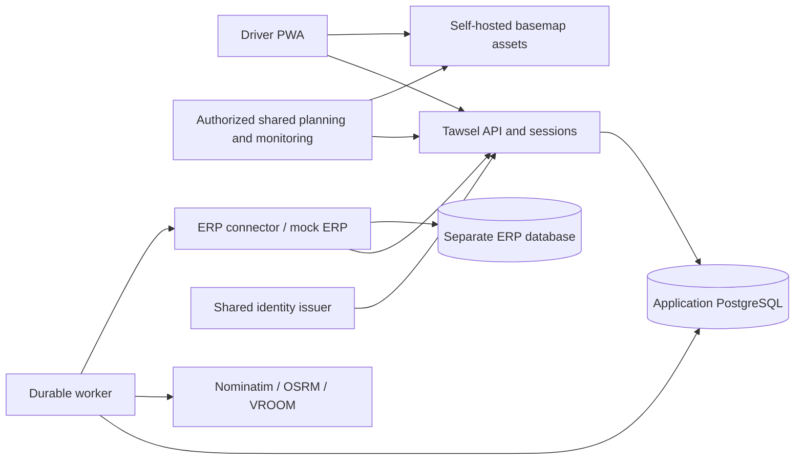

# Tawsel — master plan

**Status: implementation-planning baseline with Phases 01–02 implemented and locally verified within their scope on 22 September 2026; Phase 03 is specified and document-verified with owner review pending; Phase 04 provides verified development UI fixtures (owner review pending), and Phase 05 provides the locally verified PostgreSQL command foundation; Phase 06 adds locally verified tenant/membership/capability/resource guards with labelled principals ([evidence](docs/phase-06-evidence.md)); Phase 07 adds locally verified real login, recovery and separate sessions ([evidence](docs/phase-07-evidence.md)); Phase 08 adds locally verified ERP provisioning and issuer reconciliation ([evidence](docs/phase-08-evidence.md)); P09 independent intake and P10 ERP snapshots/receipt/admission are locally verified within scope ([P09 evidence](docs/phase-09-evidence.md), [P10 evidence](docs/phase-10-evidence.md)); P11 locations/maps, P12 Engine adapters, P13 durable planning and P14 route policy/manual fallback are locally verified within their bounds; live Engine remains unavailable. [Current evidence](docs/phase-14-evidence.md). P15 adds locally verified online round start, immutable first forecast references and departure/admission authority ([evidence](docs/phase-15-evidence.md)). Phases 16–42 remain unstarted.**

Revision: 7, 22 September 2026, with Phase 01 execution evidence added 22 September 2026. Repository planning was assessed at `3d6291697fb0baeb69215237bf1d09dbf6d1d9cd`; Phase 01 started from `eacf6b3fa596a845b4290c6f3ad471b39551e8d8`. The owner has accepted the application stack, requires meaningful Vitest integration files and an exceptionally simple, clear driver UX, and has authorized preparing implementation prompts. D-109 requires smaller bounded phases with sufficient embedded behavior, concrete cases and incremental checks, rather than broad one-shot tasks that depend on an agent's chat memory. Planning approval remains distinct from executed software, owner review of an implemented interface or measured operational readiness.

This plan turns the owner's discovery into the specification for the shared Tawsel delivery application. Confirmed decisions and review requests are recorded in [TAWSEL-DISCOVERY-LOG.md](TAWSEL-DISCOVERY-LOG.md), through D-112. The selected technology direction and UX/testing requirements are confirmed. Numerical operational defaults and boundary treatments still labelled as proposals are the documented engineering baseline to specify and verify; phase preparation does not imply separate owner approval of every proposed value. They are not claims that software exists or that a deployment has passed verification.

The [current phase package](docs/phases/README.md) contains 42 bounded sequential prompts, beginning with the workspace, then contract/state and design foundations as separate tasks. Each embeds relevant business rules, verified prerequisites, three ordered implementation checkpoints, concrete acceptance scenarios, tests and a stopping point. The [coverage matrix](docs/phases/coverage-matrix.md) assigns 65 current requirement groups, contracts, UI, tests and documents; the [decision map](docs/phases/decision-map.md) traces all D-01–D-112 including superseded answers. [Implementation status](docs/implementation-status.md) records actual execution and evidence. Phase 01 provides the runnable workspace/test harness; Phase 02 provides validated common contracts and state/operation/ERP planning foundations, with every business operation still designed. Phase 03 is specified and document-verified with owner review pending; Phase 04 provides verified development UI fixtures (owner review pending), and Phase 05 provides the locally verified PostgreSQL command foundation; Phase 06 adds locally verified tenant/membership/capability/resource guards with labelled principals ([evidence](docs/phase-06-evidence.md)); Phase 07 adds locally verified real login, recovery and separate sessions ([evidence](docs/phase-07-evidence.md)); Phase 08 adds locally verified ERP provisioning and issuer reconciliation ([evidence](docs/phase-08-evidence.md)); P09 independent intake and P10 ERP snapshots/receipt/admission are locally verified within scope ([P09 evidence](docs/phase-09-evidence.md), [P10 evidence](docs/phase-10-evidence.md)); Phases 11–42 remain unstarted. The former 11-phase package is archived as superseded; neither phase count is a delivery-time estimate.

D-110 adds an explicit [Codex model and reasoning recommendation](docs/phases/model-selection.md) to every prompt. D-111 makes the [ERP handoff files and external proof](docs/planning/erp-handoff-deliverables.md) explicit: P02 starts the planning/contract inputs, P26–P27 demonstrate the independent receiver and two-way source, and P42 validates and packages the final released artifacts. D-112 locks that compatibility to the published protocol, assigns ERP-specific translation to a separately owned connector and requires capability discovery without adding a phase. Recommendations and document preparation are not runtime verification.

## 1. Purpose and success

Build one centrally maintained, tenant-aware Arabic delivery application around the existing Nominatim, OSRM and VROOM Engine. Tawsel extends existing ERP systems with routing, trip planning, delivery execution and delivery visibility: the ERP remains the system of record for commercial/business data, while Tawsel owns delivery-execution concerns. Drivers prepare and execute their work, see a useful route, record outcomes while disconnected, and compare expected versus actual timing. Authorized company users see coherent operational progress. Future ERPs exchange work and execution updates through a reliable published boundary, without rebuilding the route/map application.

The initial real pilot is independent-driver B2C. B2B is fully specified and exercised through a clearly labelled mock ERP with durable integration behavior. The real shipping ERP remains a separate project. A mock response must never stand in for real B2C persistence or real routing in acceptance evidence.

Success requires connected journeys, an exceptionally simple driver experience, correct state under retries/concurrency, recoverable offline actions, the recognizable layout/design system of the visual references applied to the agreed functionality, measurable freshness, and a deployment the owner can test and diagnose. Each page must make its purpose, current situation, next action and any missing input or awaited confirmation obvious. Meaningful Vitest files must exercise important connected behaviors. File presence, a passing build or prototype screenshots alone do not establish success.

## 2. Confirmed scope and boundaries

| Included in V1 | Explicitly outside this scope |
| --- | --- |
| Separate B2B company and B2C independent accounts; PWA; Arabic RTL; Android/Chrome and iPhone/Safari verification | Linked personal/company workspace account; native React Native/Expo app now |
| ERP-preassigned B2B tasks; manual B2C name/phone/address or dropped pin; preparation, planning, execution and reports | Real ERP, commercial order/customer administration, global fleet assignment |
| Car, motorcycle and bicycle routing; maximum 50 remaining planned stops; ten-minute default customer service | Weight/volume fleet capacity, automatic over-limit splitting, daily 50-task cap |
| Current/next state, outcomes, simple collection records, whole-piece B2B partial delivery, source-branch returns | B2C item splitting/branch custody, financial ledger, cash settlement, merchant liability calculation |
| Roughly 24 hours of downloaded started-work/offline action support; online start for every new round | Offline new-round start, offline optimization, guaranteed complete offline basemap/navigation |
| Multiple rounds in an explicit workday; deferral; urgency; driver self-correction within approved bounds | Call counters/limits, barcode pickup checklist, signature/photo/POD workflow, incentives |
| In-app reports and Excel export; versioned initial/revised forecasts versus action-derived actuals | GPS, even one-time location capture; live driver markers; background telemetry; cross-company learning |
| Durable API/events, mock ERP, recovery, Dokploy/KVM 2 pilot and measured capacity | Billing/subscription gates, pricing/payment UI, speculative billing tables, forced server upgrades |

Keep original Engine data, volumes and working paths. Normal application releases must not import OSM data or rebuild routing datasets. Keep `stitch-export/` unchanged as design provenance. Configurable branding is permitted within one application; customer forks are not the product model.

**UI authority:** the owner's decisions and agreed plan define features, buttons, operations, permissions, state transitions and required screens. The Stitch exports define the visual layout reference and design-system direction only. Add, remove, replace or reorganize controls/screens as the requirements need, while keeping that visual language coherent. An exported button is neither a requirement nor a reason to invent a workflow; an absent button or screen is not a reason to omit an agreed operation. Visual-reference mapping is traceability, not a fixed nine-screen product boundary or pixel-for-pixel implementation contract.

## 3. Current evidence

At the planning assessment, the repository had Engine configuration and nine static Stitch exports with no shared application, backend, application database, or contracts. Phase 01 has since added a minimal React/Vite shell, Fastify workspace-health API, shared TypeScript boundary, and test/CI harness; it adds no application database, identity, worker, delivery capability, routing adapter, or public ERP contract. The source and visual assessment, exact screen IDs, defects and primary technical references remain recorded in [repository-and-ui-assessment.md](docs/planning/repository-and-ui-assessment.md), while current execution evidence is in [the Phase 01 ledger](docs/phase-01-evidence.md).

Phase 02 adds the [state foundation](docs/tracking-and-consistency.md), [operation catalog](docs/contract-coverage.md), canonical common/envelope/example schemas, deterministic public types/reference tooling and [ERP planning inputs](docs/erp/README.md). [Phase 02 evidence](docs/phase-02-evidence.md) proves local schema/tooling checks only; business APIs, transaction guarantees and external interoperability remain future work.

All nine images and HTML/metadata sources were reviewed; image and HTML hashes match the manifest. Prototype timers, alerts and demo switches do not demonstrate synchronization, payment, authentication or optimization. No application, browser-interaction, Engine runtime, device or production-load test was run during planning. `STACK-CONTEXT.md` contains historical measurements, not fresh capacity evidence.

## 4. Selected technology direction and engineering defaults

The owner has accepted **React + TypeScript + Vite, Node.js + Fastify, PostgreSQL, OIDC with Keycloak, and MapLibre + PMTiles**, alongside the earlier **shadcn/ui + Smooth UI** choice. **Vitest** is now explicitly required for meaningful tests of connected functionality. The retained Engine and KVM 2/Dokploy pilot target were already agreed. Do not reopen these stack choices without a concrete incompatibility or a new owner instruction. Exact compatible versions, package configuration and numerical operational defaults remain engineering work; stack approval does not approve every proposed product boundary or constitute deployment evidence.

Use a TypeScript workspace with a modular backend and a separate worker process sharing application modules. Avoid a broker or microservice decomposition for this pilot. ERP connectors consume released contracts, never backend internals or database tables.

| Area | Selected direction / engineering detail |
| --- | --- |
| Frontend framework — owner accepted | React + TypeScript + Vite; React Router; Tailwind/CSS theme tokens adapted from the visual references. Phase 01 self-hosts Cairo 400/600/700/800 with synthetic weights disabled; Phase 03 formalizes this baseline in shared typography tokens. No SSR requirement has been identified for the authenticated operational screens. |
| UI components — owner selected | shadcn/ui + Smooth UI, styled as one Tawsel system. Use foundational primitives and suitable animated components to implement requirement-driven stop, status, map, form and navigation views. The libraries' demo layouts/themes do not replace Tawsel's visual direction. |
| Client data | Typed contract client and a query cache for server reads; Dexie/IndexedDB for downloaded work, immutable local action envelopes and pending projections. A query cache alone is not the offline record. |
| PWA | Workbox for shell/static asset precaching; an application-owned replay queue for domain commands. Foreground reconnect/reopen/manual retry is required; background retry is an optional accelerator. |
| Backend | Node.js supported LTS + TypeScript + Fastify, organized into identity, access, intake, execution, planning, reports and integration modules. Explicit SQL transactions through `pg` and versioned SQL migrations keep locking/invariants reviewable. |
| Database/worker | Dedicated PostgreSQL application database. PostgreSQL job/outbox tables, short claims/leases and bounded worker concurrency; no initial Redis dependency. Mock ERP has a separate database and credentials. |
| Identity | OIDC authorization-code flow with PKCE and a backend session. Self-hosted Keycloak is the selected pilot credential authority for both the mock company and independent accounts; ERP and Tawsel have separate clients/sessions. See section 6. |
| Maps | MapLibre GL JS with a self-hosted regional PMTiles archive, compatible style, glyphs/sprites and Arabic support. Nginx serves assets with range support. Verify coverage and licensing. Engine route geometry is overlaid on this basemap. |
| Monitoring | Bounded polling for visible operational views, initially every one second with ETags/revisions and one in-flight request per view. This is simpler to recover than introducing a stream now and is to be measured against the three-second target. |
| Contracts | OpenAPI 3.1 + canonical JSON Schema definitions and versioned event schemas; generate client types and reference docs. Configure the matching Ajv dialect explicitly and test serializer/schema compatibility; do not assume Fastify defaults match OpenAPI 3.1. |
| Checks/operations | Vitest files for important domain, contract and connected integration scenarios using actual application modules and isolated PostgreSQL where transactions matter; Playwright for full browser/device/visual flows. Structured logs and metrics; Docker Compose through Dokploy. Pin supported dependency/image versions at implementation time. |

The main technology direction is accepted; its detailed configuration still needs verification. Keycloak adds operational/memory cost but avoids inventing credential federation and recovery. The deployment inventory must account for it; the plan makes no claim that all services fit a particular unmeasured host. [Keycloak OIDC](https://www.keycloak.org/securing-apps/oidc-layers), [Fastify validation](https://fastify.dev/docs/latest/Reference/Validation-and-Serialization/)

The fetched Smooth UI documentation provides shadcn-registry installation and a Vite/React guide listing React 19+, Tailwind CSS 4+ and Motion 12+. Treat these as compatibility inputs, then pin mutually supported versions with Vite, Vitest and a supported Node LTS; a documentation minimum is not a recommendation to deploy an obsolete Node release. No packages are installed by this planning amendment. [Smooth UI full documentation](https://smoothui.dev/llms-full.txt), [Vite compatibility guide](https://smoothui.dev/docs/guides/vite), [shadcn Vite setup](https://ui.shadcn.com/docs/installation/vite)

Suggested repository boundaries are `apps/web/`, `apps/api/`, `apps/worker/`, `apps/mock-erp/`, `packages/domain/`, `packages/api-client/`, `contracts/`, `db/migrations/` and `deploy/`. Do not move the existing Engine folders merely to match a diagram. Any necessary move requires a path/mount/script migration with preserved data. Future ERPs do not import `packages/domain/`.

## 5. Ownership, tenancy and permissions

Every organization-owned row, query, cache key, job, event recipient and export is scoped by tenant. An independent B2C account gets an isolated personal tenant. UUIDs identify resources; `(tenant, integration, external_reference)` identifies source records. Every relationship checks compatible ownership, including background jobs and joins. Tenant IDs supplied in payloads cannot override authenticated scope.

| Owner | Responsibilities |
| --- | --- |
| ERP | Commercial order/customer master, shipment content/prices/policies, branch and company user administration, roles/grants, preparation and initial assignment, actual source-branch receipt/disposition, inventory, liability and settlement |
| Tawsel | Accepted delivery tasks/dispatch cycles, assignment execution, rounds/workdays, plans/revisions, attempts/outcomes, reported collection, progress, pin corrections, forecasts and integration delivery state |
| Identity issuer | Credentials and authentication subjects; same company authority for ERP and Tawsel, separate app sessions |
| Independent driver | Their own B2C tasks, pins, urgency, simple outcomes, optional collection and reports |

One configurable ERP role per company user; direct exceptions use `inherit / allow / deny`, with explicit user choice overriding role inheritance. Effective capability is the same across all that user's assigned branches. Branch membership, own-driver assignment, integration visibility and lifecycle constraints still restrict the resource. Role names never grant permissions implicitly.

Stable operation capabilities should cover scoped monitoring, predeparture planning/location review, own execution/correction, reports/export, ERP preparation/assignment, branch receipt/disposition, identity provisioning and integration operations. Define exact keys in the contract foundation. A deep link opens an authorized view; it does not convey permission. ERP service credentials cannot impersonate arbitrary people from an unchecked `actor_id` string: validate a bound user assertion/session or an explicitly delegated service operation, and record both actor and service identity.

**Departure boundary:** accepted round start locks its dispatched shipment snapshot against general staff edits. New tasks received mid-round acquire the same execution lock when admitted to active execution. Staff cannot change outcomes, contents, recipient details, assignment or urgency after this boundary. ERP urgency is allowed before departure; assigned-driver urgency is allowed afterward (D-101). Driver execution-pin correction remains permitted. Actual driver-requested source-branch receipt and authorized loss/damage disposition are narrow exceptions, not administrative overwrite endpoints.

Before departure, normal ERP withdrawal/reassignment needs no mandatory reason or extra physical handover procedure. It races safely with start through locking/revisions. After actual return, ERP can redispatch using a new dispatch cycle with preserved history. No direct driver-to-driver handoff is introduced. Identity disabling or branch membership administration remains a separate lifecycle; it is not prohibited by the shipment lock.

Integration access never reveals another integration's tasks or contacts through a mixed-source trip. Provide a scoped projection with only authorized tasks and appropriately limited totals; redact inaccessible current/next resource details rather than leaking recipient names, pins or counts through a full-trip response.

## 6. Accounts, sessions and device ownership

Company entry asks for company code, then username/password on a Tawsel-themed identity login. Resolve company-to-issuer configuration server-side. Company selection is not authorization. The ERP administers users through its server and the common credential authority, and provisions memberships/roles into Tawsel through versioned integration operations. Do not copy ERP password hashes or require ERP availability for each delivery action.

B2C uses a normalized phone number as login identifier plus password; a verified email is used for recovery only. The identifier is not a claim of SMS-verified phone ownership. Proposed registration includes email verification before activating the recoverable account; no SMS or billing flow is added. Keep B2C and company identities separate even if contact details match. The issuer can use separate realms for company and B2C policy, without demanding one realm per tenant.

Use secure HttpOnly, same-site session cookies, CSRF defenses, restricted redirects, rate-limited sign-in/recovery and no bearer tokens in URLs. Server-side OIDC refresh belongs to the session layer. Login/first download/new round needs connectivity. An expired online session requires reauthentication to the same account before replay; it must not clear its queue. Promptly enforce account revocation when online; offline revocation cannot be instantaneous.

One round may be viewed on several phones, but only one device generation owns execution. Database constraints permit one active round and one open workday per tenant/driver across branches. Start atomically establishes ownership. Another phone shows the existing active round; `Continue on this phone` performs an online idempotent takeover and increments the generation without old-phone approval. Download the latest snapshot before enabling its actions.

The former phone may be unaware while offline. Retain its queued evidence when it reconnects, but do not silently apply stale-generation commands even if their wall-clock times look earlier. The current authorized driver may adopt a compatible received record through an explicit, validated correction/recovery action within the open-day/dependency rules. Duplicate evidence is marked as such. If real receipt/redispatch/day closure prevents an execution correction, retain the discrepancy and let ERP handle any commercial consequences; no blanket staff execution override is created.

Block deliberate logout/account switching while actions are unsynchronized. Once the server durably retains a rejected/review-required record, it can acknowledge evidence receipt separately from business acceptance; this allows a clear account exit without deleting the unresolved record. Closing/reopening the same account and returning to an already-started round is allowed offline when its data is available. Phone loss/storage clearing can lose unsent work; another device can recover only server-received state.

## 7. Domain model and state boundaries

Use distinct records rather than one overloaded shipment status:

| Record | Meaning and important fields |
| --- | --- |
| Task and source revision | Stable source identity, original address, recipient, source branch, accepted content/policy/price snapshot, confirmed execution pin and location revision |
| Dispatch cycle / assignment | Assigned driver, prepared versus received, departure lock, quantities/holder/disposition; a returned shipment's redispatch is a new cycle |
| Workday | Driver's explicit period from first round start to End day, potentially across midnight; actual timestamps and Cairo display timezone |
| Round/trip | One active execution round, device generation, vehicle mode, current activity and sequence; many rounds may belong to one workday |
| Plan/revision | Draft/ready/published/superseded route, source input fingerprint, ordered stop IDs, manual/optimized status and protected prefix |
| Stop/attempt | Shipment-specific customer visit or branch-service activity; explicit heading/arrival/resolution and outcome history. Reattempts have distinct IDs. |
| Outcome/quantity ledger | Full/partial/refused/no-answer/deferred results; piece quantities, reported collection, return-required and confirmed receipt/disposition; corrections append history |
| Forecast snapshot | First-start baseline and identified later revisions; stop/attempt identity, estimated arrival/completion and workload membership |
| Action / receipt / event | Device action ID and evidence, application result/idempotency, audit, outbox delivery and receiver processing states |

B2C does not need ERP line-item/custody behavior. Share route/execution primitives while disabling irrelevant actions by product capability and domain validation, not just hidden buttons.

### Assignment and eligibility

Prepared work is visible as upcoming, but is not on board. Definitive ERP assignment asserts physical receipt and is accepted only through the intake rules; Tawsel does not independently prove possession. Acceptance triggers replanning without undoing receipt if the Engine is unavailable.

Eligible customer work is assigned/received, has a confirmed usable pin, is an untouched deliverable portion, is not already resolved, and respects earliest availability. Deferred future work, unresolved pins, prepared stock and return-required rejected remainders do not enter the executable customer sequence. They remain visible in the correct held/upcoming/review groups.

The 50 limit applies to remaining stops in the plan being admitted, including planned branch visits, not to workday total, historical completed stops or all held records. Each shipment is independent even at identical coordinates. Atomically reject an incoming addition batch that would exceed the limit; do not accept a subset or secretly assign rejected work to a backlog. Serialize concurrent admissions. Deferred-work reactivation and retries must also pass current route admission; blocked additions remain visible in their existing disposition.

### Round and current/next state

Draft intake, successful optimization, publication and start are separate facts. Proposed UX: preview can be saved without starting; the driver's online `Start round` validates synchronized current work and publishes the chosen ready/manual plan in the same start transaction. No extra dispatcher approval is required. Pre-start staff planning remains permission-bound; once execution starts, only authorized driver actions can change execution.

`Next planned` is a suggestion. `Heading to` is an explicit driver selection. `Arrived` is an explicit driver action. After an outcome, current activity clears and a next suggestion can appear; the app does not claim that movement began. A phone call, completed order or route reorder does not prove arrival. Keep the selected heading/arrived target fixed across automatic optimization until the driver explicitly changes or resolves it.

Proposed state vocabulary is `draft -> ready -> active -> ended`, with an active branch-service interruption as an activity mode rather than another simultaneous active round. Ending a round may preserve unfinished held work. End day closes the workday after explicit resolution/pausing of any current activity and ends its active round; unfinished records carry forward without ERP re-entry. A pending offline day-end is visibly pending. A subsequent round always waits for synchronization and a fresh server-confirmed start.

### Returns, retries and corrections

No answer is a simple outcome without call counts. In B2B it leaves the delivery sequence and becomes return-required while still held. Before confirmed source-branch receipt, the same driver may explicitly retry an untouched whole return-required shipment, preserving attempts, validating any prior collection and replanning. Nothing is retried automatically; rejected partial remainders and lost/damaged goods are excluded. An untouched whole shipment can instead be deferred to an earliest date/time; this is not a narrow appointment promise.

The driver selects return items by originating branch and requests handover. Staff confirm actually received pieces in their native ERP view. Items being claimed as handed back require server-confirmed receipt before the handover/resume flow proceeds; a local request or unavailable remote confirmation cannot substitute for that confirmation. One request may be partially received; continuation does not require settling every offered item, and remaining disputed/missing goods stay explicit for ERP handling. No whole-batch clearance gate or new returns quota is added. Never claim physical receipt, available stock or settled cash merely because a request exists, a driver arrived or a loss was recorded.

Branch interruption may pause heading-to-customer work; an already handled/arrived customer attempt must first be resolved. Proposed full-capacity treatment: temporarily publish the branch-service segment while visibly pausing the customer sequence, then resume/replan that retained sequence after branch activity. The branch segment counts toward the active plan's limit. This is a visible interruption of already accepted work, not automatic splitting/admission of an over-limit incoming batch. No shipment disappears and no extra driver round starts. If this treatment cannot preserve the invariant in implementation, surface the conflict before building a different business rule.

Driver self-correction records a mistake during an open workday, before dependent receipt/redispatch. Validate ownership, effective outcome revision, quantities and money; preserve original and corrected versions. Rebuild effective progress and emit correction events atomically. A correction does not change source prices, authorize underpayment, refund money or undo a real dependent handover. Race correction against receipt, closure and redispatch under the same invariant locks.

## 8. Collection and quantity rules

Use whole pieces with stable source line references; no fractional/weight quantities. ERP explicitly supplies splitting permission. Store money as integer minor units with an explicit currency and exponent; do not use binary floating-point arithmetic. V1 examples use EGP. Sum only matching currencies and label reports accordingly.

The dispatched snapshot contains final collectable unit amounts and outstanding shipping after any source-authorized adjustments. Local partial-delivery calculations do not call ERP for a price quote. Source deposits/prepayments require exact allocation sufficient for the permitted outcomes; reject an unsupported ambiguous snapshot instead of inventing allocation or treating missing data as zero. ERP owns refunds, taxes and commercial accounting.

| Example: three pieces at 100, shipping 50 | Reported collection | Remaining business state |
| --- | --- | --- |
| Full delivery | 350 | Three delivered |
| Authorized two-piece delivery | 250 | Two delivered; one return-required |
| Complete refusal, shipping paid | 50 | All three return-required |
| Explicit refusal to pay shipping | 0; unpaid shipping 50 | All three return-required; ERP liability handling |
| No answer | No collection implied | Return-required or approved whole-task deferral/retry; no fabricated shipping refusal |

Prepaid amounts are not collected twice. Ordinary full/partial delivery requires the calculated authorized amount; no free-form short payment. Every quantity must reconcile across delivered, held, returned and explicitly disposed portions in its dispatch cycle. Retries, corrections and duplicate commands cannot charge shipping twice or duplicate pieces. Recorded collection is the driver's report, not bank verification or settled ERP cash.

B2C has a simple optional collection amount and outcomes, without item pricing/splitting, merchant fee liability or branch-return screens.

## 9. Location, route planning and urgency

Preserve source address and provenance independently from the confirmed execution pin. B2C entry requires recipient name, phone and a usable destination; allow address search and manual drop-pin confirmation. Do not add a shared-map-link parser or GPS request. Authorized staff can review B2B locations before departure; the assigned driver can correct the execution pin afterward. Ambiguous work remains visibly blocked while valid tasks can proceed.

Map searches go through the application's private Nominatim adapter, with timeouts, tenant-aware request handling and bounded caching. A result is a candidate with a source/type, not a measured accuracy percentage. Use MapLibre plus explicitly provisioned tile/style/font/sprite assets; retain required attribution. An offline map cache is best effort, while downloaded stop details and stored route geometry remain usable without it. [Nominatim Search](https://nominatim.org/release-docs/latest/api/Search/), [MapLibre basemap setup](https://docs.protomaps.com/basemaps/maplibre)

Plan from the last driver-confirmed physical stop, with optional manually selected origin. On the first round, use a confirmed branch/manual origin. A phone outcome without arrival does not advance the origin. Never label this origin as current GPS. Vehicle mode maps to the correct OSRM service; bicycle may map internally to `bike`. Use longitude/latitude order only within adapters, explicit coordinate names in public contracts, seconds for durations and metres for distances. Default service is 600 seconds per customer; branch service is a separately configured estimate, not silently a customer delivery.

End at the last customer by default. A selected B2B branch visit or B2C fixed endpoint is explicit. Estimate completion with no hard shift-end cutoff. External navigation opens the selected destination using the current device's navigation app; opening it is not a heading/arrival confirmation.

### Planning pipeline

1. Read a coherent eligible-task snapshot, origin, mode, current target, urgency, earliest availability and endpoint; store its input fingerprint/revisions.
2. Queue bounded Engine work outside database transactions. Map public IDs to temporary VROOM integers internally; apply timeout/cancellation and response validation.
3. Preserve the protected current prefix. Put currently eligible urgent work before ordinary remaining work; optimize within groups and propagate end location/time into the following segment. Future-deferred work cannot jump into execution just because it is urgent.
4. Validate the complete stitched route, expected task IDs, unassigned work, timing/earliest constraints, endpoint and stop limit. Store estimated waiting where relevant. This sequencing approach is a practical heuristic, not a claim of globally optimal distance.
5. Recheck the input fingerprint before publishing. Discard/reschedule stale results; an old optimization cannot overwrite a new outcome, selected target, urgency/pin update or assignment.
6. Persist publication/revision/forecast changes transactionally. Replanning never reverses an accepted receipt or outcome.

VROOM's `priority` field alone does **not** implement the approved urgent-first visit sequence. Its normal optimizer response may leave work unassigned; an empty violations array is not sufficient validation. Use a common time origin for the entire request. Do not use soft-constraint plan checking as proof of hard feasibility. These are adapter requirements supported by the [v1.15 API](https://raw.githubusercontent.com/VROOM-Project/vroom/v1.15.0/docs/API.md); verify the actual pinned deployment too.

If an eligible urgent task is unreachable or otherwise unplannable, show the exception and affected task rather than claiming the ordinary route satisfies urgency. Optimization success, partial result and dependency failure have different UI states. The driver can make an explicit eligible manual selection when needed; retain its history and constraints.

If the Engine is down but Tawsel is available, keep the last valid remaining order and outcome controls, or let the driver explicitly select an honest manual first route. No straight-line route is presented as verified road routing. New start still needs API synchronization/server confirmation. Receipt, deferral, no-answer retry, urgency, pin/endpoint changes and branch completion trigger online replan; offline changes retain local intent and mark planning pending.

## 10. Transactional execution and idempotency

Each accepted command runs one short application transaction. It authenticates/scopes the operation, locks relevant driver/workday/assignment/task rows in a consistent order, checks expected versions/state/device generation, writes the effective domain change and attempt history, updates progress, records its audit/idempotency result, and inserts required outbound intent. All commit or all roll back. Engine/ERP/identity HTTP calls happen outside that transaction.

Suggested constraints include one open workday and one active round per tenant/driver; one current activity; one active dispatch holder per outstanding portion; nonnegative bounded integer quantities/money; unique source references within an integration; unique action IDs within an authenticated scope; and tenant-compatible foreign keys. Use row locks/conditional updates and database constraints together, not a browser lock. [PostgreSQL locking](https://www.postgresql.org/docs/current/sql-select.html)

Scope idempotency by tenant, authenticated command source and action ID; store a payload hash and durable result. Same ID/same payload returns the established outcome; same ID/different payload is a conflict. A timeout is an unknown delivery result until queried/retried with the same ID. Do not retry a non-idempotent mutation under a fresh ID automatically.

Keep domain revision, assignment generation, route revision, device generation, contract schema version and integration sequence distinct. A newer route order alone should not reject an otherwise valid outcome for the same task/attempt/owner. A newer price/content snapshot or dependent handover is different. No blanket last-write-wins rule uses client timestamps.

Proposed command retention is at least 30 days for complete retry responses, with compact action identity/result tombstones retained for the life of the referenced business record. Very old evidence remains queryable/reviewable; it is not silently replayed as a new action after pruning. Do not purge unresolved actions or integration failures on a timer.

## 11. Offline capture, replay and conflicts

Before each new round, synchronize queued evidence, fetch the current authoritative work/permissions, verify storage readiness and obtain server-confirmed start. A stored plan alone cannot start a round offline. Once started and downloaded, the owner phone can reopen it and record allowed outcomes for the roughly 24-hour support target.

Write a local action envelope and the pending UI projection in one IndexedDB transaction before showing `Saved on this phone`. Include stable action ID, account/tenant/device generation, resource IDs/base revisions, per-device sequence/dependency, observed time and payload version. Failed local writes show failure; they must not report saved success. Download only data needed for authorized work. [Dexie transactions](https://dexie.org/docs/Tutorial/Design)

Replay in dependency order on reconnect, foreground/reopen and manual retry, obtaining fresh authentication when needed. A response receipt must be durably saved before acknowledging/removing its local pending state. Same-device tabs coordinate one replay owner, with server idempotency as the final protection. Pending local overlays must not erase the last confirmed snapshot or masquerade as an ERP-applied outcome.

| Situation | Resolution |
| --- | --- |
| Duplicate retry or lost HTTP response | Query/retry the same action ID and return the original result. |
| Route reordered, task still compatible | Validate relevant task/attempt/ownership fields; do not reject solely due to route sequence changes. |
| Prior command in the local sequence missing | Wait/resend dependency; do not process a later outcome before its required predecessor. |
| Device takeover | Preserve stale-owner evidence; require current-owner validated adoption/correction, never silent overwrite. |
| Receipt/redispatch/day closure conflicts with correction | Keep evidence and explicit rejection/review status; do not reverse dependent facts. |
| Session expired or access revoked | Preserve local queue; reauthenticate or durably receive restricted evidence without granting forbidden state changes. Do not expose it to a different account. |
| Engine/network unavailable | Continue permitted started work; route changes are visibly pending. No new server-confirmed start is fabricated. |
| Storage quota, eviction or cleared device | Detect write failures where possible; recover received data from server. Do not promise reconstruction of unsent lost data. |

Device time is evidence, not the authority for ordering. Store device capture, server receipt and server commit times separately, with clock-offset/quality metadata when known. Suspicious/missing timestamps are flagged as uncertain in timing reports. A delayed sync must not turn server receipt time into the alleged arrival time.

Request persistent browser storage and show honest availability. Self-host shell/fonts/icons; use versioned IndexedDB upgrades and backward-compatible action payload readers. Offer PWA updates at a safe point; never force a reload or clear stores while actions are pending. Workbox is not the sole expiring business queue. [Storage limitations](https://developer.mozilla.org/en-US/docs/Web/API/Storage_API/Storage_quotas_and_eviction_criteria), [Workbox retry behavior](https://developer.chrome.com/docs/workbox/modules/workbox-background-sync)

## 12. ERP delivery, event contracts and reconciliation

### ERP-agnostic integration boundary

Tawsel's compatibility target is its versioned, published integration protocol—authenticated HTTP APIs, webhook/event contracts, stable external IDs, idempotency, revisions and recovery semantics—not an ERP's internal implementation. A company can use Tawsel without granting access to ERP source code, its database or its internal schema. Tawsel core must not contain ERP-specific schemas or logic.

An ERP-side connector/adapter translates that ERP's data model, workflows and available integration mechanisms into Tawsel's public delivery contract. The ERP vendor/agency, the Tawsel team or both parties jointly may implement it. Before committing to an integration, assess the ERP's REST/API, webhooks, integration modules, authentication, stable external IDs, import/export interfaces and other vendor-supported mechanisms. If no suitable surface exists, vendor cooperation or an ERP-side adapter is required; Tawsel does not promise automatic compatibility with every ERP.

Both sides use transactional outbox/inbox patterns in their own databases. ERP source change and outgoing command intent commit together; ERP shows pending until Tawsel's acceptance is known. Tawsel business change and outgoing event intent commit together. No distributed database transaction or exactly-once network guarantee is promised.

The worker claims committed jobs with a short lease and retry schedule, sends outside the claim transaction, then records acknowledgement. Recover expired leases after crashes. Proposed retry uses jittered exponential backoff capped at five minutes; repeated failures remain visible and retained for controlled replay. A failed receiver does not block another tenant/integration. Preserve required ordering per recipient aggregate; explicitly represent gaps and unsupported versions.

Webhook envelope fields include event ID/type/schema version, tenant-bound recipient integration, aggregate ID/sequence, task/assignment/route revisions where relevant, action/source correlation, commit time and payload. Use per-recipient sequences or explicitly documented gap semantics after visibility filtering. Never equate a version number with an event sequence or leak another recipient's hidden events.

Sign the exact transmitted bytes with a rotated integration secret and timestamp, with explicit algorithm/key identifier and replay checks. Retries keep the event ID while using a fresh delivery signature timestamp. Receiver validates authentication/schema/recipient, stores its inbox entry durably, then acknowledges receipt. If applying asynchronously, publish a separate processed checkpoint/status. Update projection and processed marker in one ERP-local transaction. Duplicate delivery returns its durable state without duplicating inventory or collection projections.

Execution transitions and corrections are durable business events. Progress snapshots are replacement views with a revision. A consumer can ignore an older replacement snapshot, but cannot discard a required quantity/receipt transition just because a newer progress view arrived. Detect ordering gaps, replay retained events, or reconcile from a scoped authoritative snapshot/checkpoint with clear semantics. Keep the durable consumer inbox even if transport acknowledgement was lost.

Proposed retention: replayable event payloads for at least 30 days; failed/unprocessed work retained until resolved; longer-lived audit/business facts and deduplication identity. For this private pilot, do not automatically purge business history before a retention policy is approved. Monitor growth. A recovery snapshot beyond the replay window restores current projections, but does not invent missing historical financial transitions.

Configure webhook URLs only through authorized integration administration, with network destination controls and protected secrets. Mock development endpoints are explicitly isolated. Logs carry correlation IDs/status, not full credentials, recipient addresses or request bodies by default.

The mock ERP demonstrates native preparation/assignment, role/user provisioning, driver return-request review, subset receipt/disposition, durable command outbox and event inbox/projection, processed acknowledgements and fault injection. It has separate storage and implements the contract as an external client. It is not a commercial order/inventory system or a backdoor to Tawsel tables.

## 13. HTTP contract coverage

These are required operation families; final URL/field names are contract-foundation work, not released interfaces in this draft.

| Family | Reads/commands and required behavior |
| --- | --- |
| Session/context | Company discovery, authenticated subject, effective capabilities/branches, B2C recovery/account status, active-device context and safe logout |
| Integration provisioning | Bound tenant/integration setup; versioned branches, users, one role/user overrides and execution driver/profile references; no credential values in task payloads |
| Intake | Source task snapshots/revisions, prepared work, definitive assignment/batch admission, normal predeparture withdrawal/reassignment; per-batch accepted/rejected result |
| Locations | Scoped candidates, original/confirmed location, authorized pin update with revision/provenance |
| Planning | Draft/preview, async job status, manual plan, complete/partial/error result, publish/start and replan request with input revision |
| Execution | Round start/end, current selection, heading, arrival, full/partial/refusal/no-answer/deferral, urgency, eligible retry, correction and device takeover |
| Returns | Driver request, source-branch groups, ERP actual subset receipt, distinct loss/damage disposition and redispatch references |
| Monitoring/history | Coherent driver/round snapshots, current/next/progress, held/prepared work, history and conditional refresh; scoped integration projections |
| Sync/recovery | Action batch submission with per-action results, durable evidence receipts, action status, received conflicts, allowed resolutions, outbox delivery/processed status and replay/checkpoint recovery |
| Reporting | Workday/round outcomes, quantities/recorded amounts, initial/revised forecast comparisons and equivalent authorized Excel export |

Specify UUID/external-ID mapping, currency/minor units, integer quantities, timestamp/timezone rules, limits, pagination, auth/scopes, asynchronous status, idempotency and revision headers/fields, stable errors and additive/breaking compatibility policy. Error examples must cover over-limit batch, invalid pin, unauthorized resource, forbidden departed edit, stale revision/device, unsupported price allocation, dependency failure, unassigned route and uncertain retry result.

Keep public schemas independent of VROOM/OSRM raw payloads. Generate usable API documentation and typed clients from canonical contracts; validate examples and captured real messages in CI. Shared schemas have one definition with explicit references, not hand-copied frontend/backend variants. Version both HTTP and event evolution, including how old queued PWA actions remain interpretable during deployments.

## 14. Operational monitoring and freshness

An authorized snapshot shows driver, workday/active round, execution owner/freshness, current activity and stage, next planned stop, effective outcomes, remaining eligible work, held returns/deferrals/prepared work, route revision and last committed change. Staff can review received evidence only; unsent offline actions are not server knowledge.

Read related fields from one coherent database snapshot; do not assemble contradictory task counts/current/next from unrelated latest queries. Poll visible active views every one second initially, one in-flight request with conditional revision/ETag responses. Apply responses only if their relevant revision is not older than the displayed confirmed view. On foreground/reconnect, fetch a complete snapshot before presenting current information; timeout/error backoff must show stale state. This avoids a snapshot/subscription race because no stream is required initially.

Proposed stale threshold is ten seconds without a successful refresh for an actively monitored view. An idle driver is not offline merely because no outcome changed. Separate transport freshness, last action time and last known device contact. Browser backgrounding may suspend updates; show the recorded refresh time instead of promising background freshness.

Acceptance targets under healthy measured conditions are **p95 no more than three seconds from Tawsel commit to an active shared view**, and **p95 no more than five seconds from commit to mock ERP projection application**. Also report p50/p99, errors and load conditions. Offline capture is excluded until Tawsel receives/accepts it; receiver outages are shown as lag, not hidden inside a passing average. Instrument commit/render/application times with clock uncertainty accounted for.

Start measurements with five drivers and two observers, then increase realistic concurrent actions/observers and Engine jobs to locate the bottleneck. These are benchmark steps, not user/account limits or claimed host capacity. Upgrade based on CPU/memory/I/O, latency, queue age and failures that the owner can inspect.

## 15. Reports, actual timing and Excel

Workday identity follows explicit start/end and can cross midnight. Store UTC instants; render actual dates/times using `Africa/Cairo`, including offset changes, rather than assuming a fixed EET offset. Default reporting follows the workday; filters may select round/driver/authorized branch and outcome.

Keep full deliveries, partial deliveries, unsuccessful attempts, deferred work, return-required goods and confirmed branch returns distinct. A repeated attempt does not create a second shipment. Show processed-stop completion separately from shipment delivery success, with explicit denominators and a plan revision when scope changed. Example: six full deliveries, one failure and eleven remaining = seven processed of eighteen, not seven delivered. Sixteen full deliveries and two failures = eighteen processed, 88.9% full delivery. Quantity totals and branch visits have their own units.

Retain the first forecast at round start and each identifiable revision. Compare arrival with recorded arrival and completion with recorded resolution for the same stop/attempt. Show travel/service duration only when matching actual boundaries exist. No-answer by phone without arrival has no invented arrival/travel duration. Device clock uncertainty is visible; server receipt is not substituted. A new workload or paused branch interruption is labelled so it is not misreported as simple driver lateness against an unchanged schedule.

Whole-round comparison shows original scope/estimate, latest scope/estimate, actual start/end when available, unfinished work and pauses. An early end with remaining work is not successful completion of the original forecast. Corrections update effective reports while preserving original history and forecast identities. No performance incentives, driver ranking or learned prediction is introduced.

Collection reports include goods and shipping actually reported on successful and refused deliveries, plus explicit unpaid shipping; never describe these as remitted balances. Excel exports use the same authorized filters/snapshot, units, timezone, definitions and missing-value semantics as the view. Write user-provided content as text, never formulas; authorize both export creation and download and expire stored output. No cross-tenant report endpoint is added.

## 16. UI journeys and visual-reference map

Preserve Cairo typography, light surfaces, navy primary actions, blue accents, map/list relationships, RTL hierarchy and role-appropriate navigation. Semantic amber/red/green must describe a state rather than create competing brands. Use responsive layouts, not screenshot device frames. Package fonts/icons locally with licenses and remove prototype-only asset/style dependencies.

Derive the action inventory from the agreed business flows first, then compose it within the reference layouts. Remove unsupported prototype controls, add the missing agreed controls, and adapt their placement when necessary for usability. New dialogs/pages use the same type, spacing, surfaces, navigation and component variants. The mapping below identifies useful visual references for plan-defined journeys; it does not grant business authority to the exported HTML or require every exported page to survive as a separate route.

Use shadcn/ui for suitable foundational controls and Smooth UI for suitable components/interactions, with one shared token/theme layer. Recommended starting points are form fields/buttons/tables/dialog primitives plus selected animated tabs, progress feedback and panel transitions. Component choice must follow the required behavior; do not install the full catalog or introduce extra steps to accommodate a showcase component. Wrap or adapt the selected source into stable Tawsel components, avoiding competing implementations of the same control. Inspect each registry item's actual API, dependencies, styling and accessibility before adopting it; compatibility with the shadcn ecosystem does not guarantee identical props or a safe blind replacement.

Keep animation short and purposeful, respect reduced-motion preferences, and retain immediate access to execution controls. Animation completion never determines whether a command was saved or synchronized. Verify RTL direction/keyboard behavior, focus trapping/restoration, touch behavior and rendering cost on the target phones after customization; a library's accessibility claims do not replace application checks. [Smooth UI installation](https://smoothui.dev/docs/guides/installation), [shadcn RTL guidance](https://ui.shadcn.com/docs/rtl)

### Driver simplicity is an acceptance requirement

The owner explicitly prioritizes very low cognitive load over displaying every capability on one page. Use a clear page purpose and one visually dominant next action for the current stage, with only immediately relevant supporting controls. This is a hierarchy rule, not an arbitrary prohibition on useful call, WhatsApp or navigation shortcuts. Keep recipient identity and essential delivery information easy to find.

Every state must answer in plain, brief Arabic: what am I doing; what is required from me now; what is missing or blocking progress; and what am I waiting for, if anything? Show a concise status near the affected task, its cause and the appropriate next action. Distinguish an actionable problem from a state where the driver can simply continue or wait. A disabled button without an explanation is insufficient.

Use progressive disclosure: less frequent deferral, urgency, correction, return and history options belong in an obvious contextual menu/detail view when relevant. A required missing input or critical blocker stays visible. Do not put all capabilities, error details, counters and workflow explanations on the active delivery page. Do not expose revisions, idempotency keys, worker terminology or internal integration diagnostics in routine driver copy.

Use a short modal or bottom sheet for one focused choice, such as outcome or earliest time; use a dedicated page for longer item selection, location review or reports when needed. Separate tasks visually through spacing, headings, surfaces and contrast, not color alone. Avoid nested modals, duplicated confirmations and a new page for every trivial action. Back/cancel preserves entered data and does not silently commit an outcome. Disclosures must not add unnecessary steps to the common delivery path.

Illustrative state hierarchy, to refine in the UI specification without changing approved transitions:

| Driver context | Main purpose / dominant action | Context shown only when needed |
| --- | --- | --- |
| Today's work | Clearly start a ready round or continue the existing one | Missing location, required sync, another-device execution and prepared work remain plainly labelled |
| Selected next customer | Identify the destination and explicitly begin heading there | Recipient contact/navigation shortcuts; relevant task options |
| Heading / arrived | Show the current stage and its next explicit action | Arrival then an appropriate outcome/collection flow; no wall of unrelated operations |
| Partial delivery | Select accepted whole pieces and see the exact amount in a focused view | Only for ERP-authorized B2B splitting; show the rejected remainder's return consequence |
| Offline save | Briefly show that the result is saved on this phone and awaiting sync | Detailed action history/retry is available separately; do not force a sync page after each outcome |
| Branch handover | Show the received subset and any confirmation still awaited | State whether the driver needs to act or is awaiting branch confirmation, using the approved subset rules |

The progressive interface retains explicit heading/arrival and approved authority/receipt rules. Simplicity must not infer physical movement, fabricate a confirmation or hide an unresolved dependency. It should remove presentation clutter and repeated clerical steps.

Review the representative driver flow with the owner before copying patterns across all views. For each ready, active, missing-input, pending and failed state, the reviewer should identify its purpose, next action and blocker/waiting status without an explanation from the implementer. Record confusing labels, excess competing actions and unnecessary taps as UX defects, even when the API works and the screen resembles its visual reference. Carry these checks into `DESIGN.md`, `docs/ui-spec.md` and every UI implementation prompt.

Recommended check viewports are 360 × 800 and 390 × 844 CSS pixels for mobile, and 1366 × 768 and 1440 × 900 for desktop; also test zoom, long Arabic content and real device safe areas. Isolate phone numbers/IDs/coordinates with LTR behavior. Provide visible focus, accessible names, sufficient contrast and roughly 44px touch targets. A pin must also be confirmable without requiring a precise drag gesture.

| Reference directory under `stitch-export/screens/` | Role/journey | Required contract/state dependencies |
| --- | --- | --- |
| `04-login-workspace` | Separate company/B2C sign-in, recovery and authorized branch context | Session, membership, access, expired/offline continuation and pending-logout states |
| `05-driver-daily-trips` | Prepared/upcoming, active, completed and held work; enter/continue round | Workday/round lists, online start, another-device ownership, pending day-end |
| `01-active-driver-trip` | Active map/list, explicit current versus next, remaining work | Coherent progress, plan revision, current selection, urgency, offline overlay and branch interruption |
| `02-stop-details` | Recipient/call/WhatsApp/navigation; heading/arrival/outcome | Source snapshot, line quantities/amounts where B2B, deferral/retry, correction and pin permissions |
| `03-dispatcher-workspace` | Shared selected-driver planning and operational monitoring | Scoped driver snapshots/history, predeparture planning, departed read-only state, received discrepancies |
| `06-route-preparation` | Assigned-work readiness and preview; adapted B2C intake | Intake/limit result, eligibility, manual/optimized plan, async partial/failure/stale result and online start |
| `07-location-review` | Source address/candidate/pin review; mobile extension | Geocoding, location provenance/revision, allowed editor and blocked-task status |
| `08-trip-completion` | Round/workday result and timing report; return to daily list | Effective outcomes, held work, recorded collections, initial/revised forecasts, end commands and Excel |
| `09-sync-conflicts` | Local pending, durably received, accepted and review-required actions | Action status/replay, ownership/revision conflicts and allowed recovery; separate ERP delivery/application lag |

Driver journey: sign in -> today's work -> prepare/preview -> online start -> active trip -> stop details/outcome -> next explicit selection -> summary/end round or day. Sync review is accessible whenever an action is pending or needs attention. Branch returns and correction/urgency/deferral controls extend these views without adding an administrative module.

Company journey: sign in -> authorized branch/driver view -> predeparture route/location preparation when permitted -> monitoring/history/report after departure. ERP retains shipment selection/assignment and actual receipt/disposition UI. There is no extra shared-application dispatcher approval step. Publication and start use section 7's semantics instead of copying a prototype button label.

Necessary extensions include B2C registration/recovery and fast manual intake; mobile pin review; start/manual-route/partial-result feedback; takeover confirmation; whole-piece outcome selection; driver correction; urgency/earliest-time controls; source-branch return request/status; forecast/report/export view; and clear session/storage/conflict recovery. Do not add full fleet management or merchant administration to fill prototype empty space.

Every relevant view needs loading, empty, invalid input, permission denied, dependency unavailable, partial result, stale data, pending, confirmed and rejected states as applicable. Demo network switches/timed success stay only in labelled development fixtures. No production copy refers to screen numbers, GPS accuracy, encrypted device memory or automatic financial settlement without a real supported feature.

Early visual review must compare one connected mobile journey and a desktop monitoring view against the reference design language while checking their action inventory against the agreed plan. Record intentional additions, removals and adaptations; these are expected implementation work, not failures to copy the screenshots. Complete the required screen/state coverage after shared components are proven. Visual fixtures and API-connected behavior are separate evidence; a static reproduction of nine images does not finish the application.

## 17. Deployment, recovery and owner-led operations

Target Hostinger KVM 2 with Dokploy. Before editing deployment, inventory actual machine resources, other workloads, Engine versions/datasets/mounts and current routing network. Build reproducible application images; select supported pinned versions; keep secrets outside Git and provide safe example configuration. Development defaults/passwords must not become production configuration.

Expose the PWA/API and identity issuer through HTTPS. Keep PostgreSQL, Nominatim, OSRM and VROOM internal. Serve range-capable basemap assets deliberately. A deployed mock ERP is private/test-only and clearly labelled. Ordinary app deployment touches neither map imports nor routing preprocessing. Record immutable dataset/image compatibility and independently schedule any future Engine refresh.

Use expand/contract database migrations with one migration runner, predeployment backup and explicit rollback/forward-recovery instructions. PWA/backend compatibility covers queued old actions. Health separates liveness, database readiness, worker heartbeat, Engine availability and integration lag; an Engine outage should not label already stored execution as lost or unnecessarily disable valid outcomes.

Track API latency/errors, database locks/pool use, worker lease recovery, oldest pending job/event, retry/dead-letter counts, projection lag, Engine timeouts/unassigned responses, host resource pressure, disk growth and backup success. Use structured correlation IDs. Give the owner a small operations view/runbook with actionable symptoms and reproduction steps; avoid a large monitoring platform before evidence warrants it.

Proposed recovery objectives for the real pilot are **RPO at most 15 minutes and RTO at most four hours for server-stored application data**. Meet them with PostgreSQL base backups/WAL archiving to a separate failure domain and a timed restore rehearsal, or revise the objectives transparently before live use. Identity configuration/storage and integration secrets also need recoverable protected backups. Server backups cannot recover unsent lost-phone actions.

Snapshot/export Engine configuration and record how to restore datasets without accidentally rerunning import against active data. Back up immutable map/routing artifacts or maintain a verified reproducible restore source; document the different restore time from application data. Do not claim backup success from job exit alone: restore into an isolated environment and verify a known trip/action/event checkpoint.

Launch configuration still needed: actual host/co-location inventory, domains/TLS, outbound recovery-email sender, backup destination/access, map archive coverage/size, issuer/tenant provisioning and real test devices. These are concrete operational setup needs, not new unresolved product questionnaires. Do not deploy using invented values or present unrun checks as passed.

## 18. Acceptance evidence and traceability

Implement meaningful checks around state and failure boundaries. Do not create tests that merely mirror markup or count implementation methods. The following coverage is required before the corresponding capability is declared complete.

### Required Vitest files for connected behavior

Vitest is the selected runner for focused domain/contract tests and important cross-module integration scenarios. Create real `.test.ts`/`.test.tsx` files alongside the functionality they verify, with project configuration and documented commands for local watch, a single CI run and integration selection. Separate fast tests from database/integration projects so the owner can run the relevant suite and locate a failure. Use the supported `test.projects` configuration for the pinned version where appropriate. [Vitest guide](https://vitest.dev/guide/), [test projects](https://vitest.dev/guide/projects.html)

The following are required scenarios with suggested file names/locations, not placeholder files to create before their implementation exists:

| Suggested Vitest file | Connected behavior and evidence |
| --- | --- |
| `apps/api/test/integration/outcome-progress-outbox.test.ts` | Submit through the real API handler, execute domain rules and PostgreSQL transaction, read coherent task/round progress and committed outbox. Duplicate action changes the business state once; injected failure rolls everything back. |
| `apps/api/test/integration/start-assignment-race.test.ts` | Online start versus ERP withdrawal/reassignment and concurrent capacity admission, using independent connections/transactions; no stale assignment starts or partially accepted over-limit batch. |
| `tests/integration/outbox-inbox-recovery.test.ts` | Run actual Tawsel worker and mock ERP receiver/projection code against separate test databases and a test HTTP boundary. Exercise duplicate delivery, commit-before-send crash, receiver processing failure, out-of-order gaps and recovery. |
| `tests/integration/offline-device-takeover.test.ts` | Connect action-queue/replay code to the API and ownership state: reconnect, lost response, duplicate replay and a former device's delayed action after takeover. Verify preserved evidence and no stale overwrite. Browser storage/reopen durability also requires real-browser checks. |
| `apps/api/test/integration/partial-return-correction.test.ts` | Partial quantities/collection -> return request -> confirmed subset -> reports/events; correction races with receipt/day closure; no duplicate pieces, shipping collection or false return. |
| `apps/api/test/integration/authorization-isolation.test.ts` | Authenticated tenant/branch/driver/integration restrictions across commands, monitoring and exports, including another integration's tasks within a shared trip. |
| `apps/api/test/integration/planning-publication.test.ts` | Planning adapter/result validation -> publication -> current/next state; urgent ordering, partial/unassigned results and obsolete results cannot overwrite current decisions. Use explicit Engine-boundary fixtures plus separate live-Engine verification. |
| `apps/web/src/features/execution/driver-flow.test.tsx` | Component/state/client integration for the stage-specific primary action, relevant secondary controls, required-input explanation and local-pending versus server-confirmed feedback. Assert observable user behavior rather than class names or DOM snapshots alone. |

Use isolated PostgreSQL with the real schema/migrations for transaction, locking, constraints and durable-outbox claims. Do not replace these guarantees with an in-memory repository mock. Isolate fixtures per suite/test and clean up only dedicated test resources. Commit/crash and concurrent-connection cases must cross real commit boundaries; wrapping the entire scenario in one outer rollback transaction would hide the behavior under test.

Control external Engine/issuer/network boundaries where necessary for reproducible failures; identify what is simulated and retain separate live-service checks. Avoid mocking every module in a purported integration test. Use deterministic identities/time and observable completion signals instead of arbitrary sleeps. Test descriptions and failure output identify the failed business invariant. UI pending/error tests may control HTTP responses, but must not be reported as full backend integration evidence.

Playwright remains responsible for full browser navigation, actual PWA storage/reopen/service-worker behavior, visual/RTL checks and real device follow-up. Vitest files complement that evidence. Each implemented capability includes its relevant tests in the same phase; do not defer the entire suite to final handoff, create empty pass-only files or chase a blanket coverage percentage at the expense of meaningful connected scenarios.

| Acceptance group | Demonstration / failure evidence | Main deliverables |
| --- | --- | --- |
| A — B2C real journey | Register/recover, enter at least two real persisted tasks, confirm pins, plan/start, execute and view/export report; exercise each vehicle adapter with suitable fixtures | Web/API, contracts, screens 1/2/4/5/6/7/8 |
| B — B2B boundary | Mock ERP preparation -> received assignment -> planned/start -> outcome -> shared view -> signed event -> durable mock projection; no direct DB coupling | Mock ERP, API/events, integration guide |
| C — Admission/authority | Atomic >50 rejection and concurrent admission; prepared not held; start versus removal race; postdeparture staff edit/urgency denied; driver urgency allowed | Domain constraints, API/permission tests, D-57/D-66/D-91/D-101 |
| D — Execution | Current/next independent; no inferred movement; current-stop protection; deferred eligibility; no-answer retry history; branch interruption; one active round across devices/branches | Domain tests and connected screens 1/2/5 |
| E — Quantities/money | Full/partial/refusal/unpaid-fee examples; prepaid no double charge; integer validation; unsupported deposit allocation rejected; duplicate/corrected actions conserve amounts/pieces | Contracts, PostgreSQL tests, screens 2/8 |
| F — Returns/corrections | Source branch only, confirmed subset receipt before resume without whole-batch gate, unavailable receipt remains pending, loss distinct from receipt, no remainder revisit, correction versus receipt/redispatch/day-end races | Mock native receipt UI, transactional tests, events/history, D-68/D-80/D-95/D-96 |
| G — Atomicity | Inject failure after domain writes but before commit; no partial progress/audit/idempotency result/outbox. Race duplicate outcomes; exactly one effective business change | PostgreSQL fault/concurrency evidence |
| H — Durable synchronization | Crash after commit before send; lost response; expired worker lease; receiver crash before/after projection write; duplicate/out-of-order/gap/replay and long outage recovery | Worker/mock scenarios, signed message/schema validation |
| I — Offline/device | Approximately 24-hour started-work round trip; reopen; pending-to-confirmed; same-account reauth; logout block; takeover with former-phone queued evidence; storage failure; safe app update | Real Android/iPhone browser checks and replay tests |
| J — Planning failure | All requested IDs reconciled; urgent-first semantics; earliest/current/end protected; unassigned/unreachable explicit; stale optimization discarded; manual route on Engine outage | Adapter fixtures plus live pinned-Engine checks |
| K — Monitoring | Coherent counters/current/next under changes, nonregressing responses, stale/reconnect recovery; measured p95 3s Tawsel/5s ERP with load and errors reported | Monitoring queries, metrics and load report |
| L — Isolation | Other tenant/branch/driver/integration denied for reads, writes, jobs, events, cached data, mixed-trip summaries and exports; manipulated actor IDs do not grant authority | Authorization and integration tests |
| M — Time/report | Workday across midnight, missing/uncertain actuals, first/revised forecast distinction, changed workload, corrections, matching Excel rows/units/timezone | Report tests and owner review |
| N — Visual/function | Traceability to all nine visual references; plan-defined actions complete and unsupported prototype actions removed; coherent shadcn/Smooth UI theming, RTL/reduced-motion/focus behavior, long names, zoom/safe areas, no critical clipping, real failure/pending/confirmed states | Browser/interaction evidence; visual-language review plus separate functional coverage |
| O — Operations | Clean deploy with preserved Engine data, migration recovery, restart/replay, backup restore timing, measured resource usage and owner diagnostics | Operations runbook, configuration and restore/load evidence |
| P — Driver simplicity | Each page/state clearly communicates purpose, next action, missing input and awaited confirmation; one dominant stage action, concise copy, discoverable contextual actions, focused modals/pages, no unnecessary confirmations or technical clutter | Owner walkthrough, UI specification and Vitest/Playwright interaction evidence; visual fidelity alone does not pass |

Run a small deterministic integration demonstration with at least two stops and real accepted messages before scaling. Then exercise failures, target devices and owner-led usage. Record passed, failed and unrun checks accurately with code/config versions; no claim of universal readiness or unmeasured supported concurrency.

## 19. Required repository deliverables and dependency order

| Deliverable | Required substance |
| --- | --- |
| `master-plan.md` + `TAWSEL-DISCOVERY-LOG.md` | Implementation-planning baseline, confirmed decisions, explicit amendments and clearly identified engineering proposals |
| `DESIGN.md` | Reference-derived visual tokens/layout rules, shared shadcn/ui + Smooth UI theming/component and motion conventions, Cairo/RTL/spacing/map/stop rules, simple action hierarchy and progressive-disclosure conventions |
| `docs/ui-spec.md` | Exact visual source IDs/paths/commit; requirement-derived routes/actions/states and API dependencies; explicit additions/removals/adaptations; per-state purpose/next-action/blocker/waiting copy; focused modal/page boundaries; functional, visual and simplicity acceptance |
| `contracts/openapi.yaml`, `contracts/events/`, `contracts/examples/` | Valid schemas, examples, auth/errors/idempotency/concurrency/recovery, versioning and generated usable API reference |
| `docs/tracking-and-consistency.md` | Authoritative state/quantity/current-next invariants, transaction/lock boundaries, polling freshness, offline/ownership and durable integration semantics |
| `docs/integration-guide.md` | Provisioning, credentials, source references, submission, native ERP receipt, monitoring, signatures, durable inbox/outbox and reconciliation |
| Application + mock ERP | Functional connected product and externally behaving durable mock, not screenshot-only shells |
| Vitest configuration and real test files | Runnable domain/contract and connected integration suites; isolated database fixtures, documented watch/CI/integration commands, meaningful failure output and coverage mapped to the implemented invariants; browser evidence remains separately identified |
| README, `.env.example`, `docs/operations.md` | Safe reproducible setup/deploy, separate Engine lifecycle, migrations, sessions/email/maps, metrics, backups/restoration and failed-work recovery |
| `docs/implementation-status.md` | Actual completed work, versions, evidence, known limitations, unrun checks and next approved work |
| `docs/ERP-INTEGRATION-HANDOFF.md` | Final as-built connector obligations and released contracts/examples, evidence, limits and future location boundary |
| `docs/phases/` | Revision 3 under D-109–D-111, amended by D-112 without changing phase count or order: 42 bounded prompts with model/reasoning recommendations, current requirement/decision maps, ERP handoff deliverables and phase review checklist; no phase executed during preparation |

The ERP handoff includes docs/erp/README.md, ERP-PLANNING-INPUT.md, field-and-status-mapping.md, consumer-quickstart.md and release-manifest.json alongside docs/ERP-INTEGRATION-HANDOFF.md and the canonical contracts/examples/public client/reference mock/conformance suite. These are future implementation outputs with exact ownership and proof criteria in the handoff deliverables plan. The real ERP calls Tawsel's published boundary; Tawsel privately calls the Engine. P26/P27 must already establish external interoperability before P42 assembles the final bundle; files alone cannot establish completion.

The dependency order is workspace -> contract/state design -> visual/action specification -> representative UI -> atomic database/access/identity -> separate intake, maps, adapters and planning phases -> separate start/current/outcome/scheduling/workday/owner phases -> returns/interruption/correction/monitoring -> sender/receiver/native mock -> focused connected UI -> local capture/replay/session-update recovery -> report/export -> diagnosis/deploy/restore/device review/handoff. The 42 prompts and coverage map make each result reviewable without a hidden dependency on chat memory. Feature phases complete their canonical operation schemas/examples before handlers rather than receiving a giant all-API implementation in one foundation task. Keep the mapping current if actual evidence justifies a further bounded split; never hide unfinished requirements under a completed phase label.

Each later phase prompt must read current instructions/code, preserve unrelated work and data, state exact scope/exclusions, update affected contracts/docs, name the relevant Stitch visual references and plan-defined behavior for UI work, use the selected shadcn/ui + Smooth UI component system, provide meaningful acceptance checks and report evidence honestly. Explicitly instruct implementation to add/remove/adapt prototype controls according to the approved requirements while preserving the layout/design system and very simple driver UX. Relevant implementation phases must create/run their meaningful Vitest files for connected behavior and report exact passed/failed/unrun checks. Empty placeholder files do not satisfy a deliverable.

## 20. Deferred extensions and current status

Future GPS can attach to stable tenant/driver/device-session/trip/assignment identities while remaining separate from business outcomes. A later contract can carry sample ID/sequence, coordinates, accuracy, sampled/received times and permission/retention rules. It needs stale/out-of-order handling and a separately authorized map layer; it does not automatically imply arrival or delivery. Do not create telemetry endpoints/tables or live markers in V1. Reassess PWA/native background constraints when that work is actually planned.

Native mobile, traffic/history learning, pooled cross-company intelligence and B2C monetization remain future decisions. Preserve extension boundaries without speculative modules or billing gates.

The operational questions from rounds 1–10 are consolidated. The owner has clarified the visual-reference hierarchy, selected shadcn/ui + Smooth UI, accepted the stack and required meaningful Vitest plus exceptionally simple driver UX. D-108 authorizes phase preparation and D-109 replaces the overly broad first division with smaller self-contained tasks. The stack and preparation questions are closed. Detailed full-capacity branch interruption treatment, polling/retention defaults and recovery objectives remain labelled engineering proposals to specify and verify against accepted rules. Actual capacity, deployed versions, map coverage, browser persistence and restore performance remain unverified. Phases 01–02 establish the verified workspace and common contract/state/tooling foundation recorded in their evidence ledgers. The [Phase 03 specification](docs/ui-spec.md) now formalizes the visual/action system with [document evidence](docs/phase-03-evidence.md), not runtime UI. The [Phase 05 evidence](docs/phase-05-evidence.md) verifies the database kernel with real commits and synthetic counters. P06–P08 now add verified authorization, sessions and provisioning. The next implementation task is Phase 09; no business execution, deployment or ERP interoperability is implied by this foundation.

P11 execution update, 22 September 2026: [evidence](docs/phase-11-evidence.md) and [location/map demonstration](docs/locations-and-maps.md) record separate confirmed pins, scoped source/driver authority, real regional map assets and pending planning invalidation. Actual private Nominatim availability, departure, routing and device/owner approval retain their stated limits. Phase 12 is next; it was not executed here.
